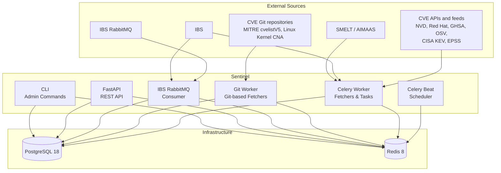

<picture>
<source media="(prefers-color-scheme: dark)" srcset=".github/assets/banner-dark.svg">

</picture>

Security update management platform for SUSE and openSUSE-based Linux
distributions. Sentinel automates CVE tracking, impact analysis, and
update coordination across multiple maintained distribution versions,
following the SUSE maintenance workflow and integrating with SUSE-internal
services.

## Overview

### What Sentinel does

- Ingests CVE data from public sources (NVD, MITRE, Red Hat, GHSA, OSV,
  CISA KEV, EPSS, Linux Kernel CNA)
- Creates and manages security tickets from CVE detections
- Tracks which packages, codestreams, and products are affected
- Synchronizes the product catalog, lifecycle dates, and CVSS thresholds
  from SUSE-internal services (SMELT, AIMAAS), and resolves each package's
  codestreams, products, and maintainers through SMELT
- Evaluates product eligibility based on CVSS thresholds and lifecycle
- Detects when security fixes are released via IBS, the SUSE-internal build
  service
- Provides a REST API for vulnerability analysts, team leads, and automation
- Offers a CLI for administrative operations

### What Sentinel does NOT do

- Build or submit packages (IBS handles builds)
- Manage product lifecycle or release schedules (SMELT/AIMAAS own this)
- Provision user identities (deferred to external identity provider)
- Provide a web UI (frontend will be developed in a separate repository)

### Key concepts

- **Ticket** (`SNTL-n`) — the workflow unit that tracks the triage, analysis,
  and resolution of one security issue, with or without an associated CVE.
- **Track** — a maintained line of a package: an IBS codestream or a Git
  branch (SLFO).
- **Product** — a SUSE product that receives updates through its own
  repositories; eligibility is evaluated per product.
- **Three orthogonal dimensions** — *affectedness* (is the code vulnerable,
  per track), *eligibility* (does the product qualify for a fix, by CVSS
  threshold and lifecycle), and *delivery* (how far the fix has progressed
  through the maintenance pipeline). See the
  [Package Model](docs/features/packages/package-model.md#three-orthogonal-dimensions).

## Architecture

All runtime processes (API server, Celery worker, Git worker, Celery Beat,
and IBS RabbitMQ consumer) run from a single OCI image with different
entrypoints. See [docs/architecture.md](docs/architecture.md) for the
architectural decisions and [docs/system-map.md](docs/system-map.md) for
detailed component and data-flow diagrams.

## Project Status

Sentinel is in **active pre-1.0 development**.
The API is not yet considered stable — breaking changes may occur in minor
version bumps, but `1.0.0` is never selected automatically by a breaking
commit. Graduation is intentional after the documented criteria are verified.
See the [Release Process](docs/deployment.md#release-process).

Implementation progress is tracked in the
[milestones](https://github.com/StayPirate/sentinel/milestones).

## Verifying Releases

Each versioned container release includes a CycloneDX SBOM plus signed SBOM and
build-provenance attestations bound to the immutable image digest. Download the
SBOM from the GitHub Release assets and verify the image attestations with
`gh attestation verify`. See
[Release Supply-Chain Artifacts](docs/deployment.md#release-supply-chain-artifacts)
for artifact meanings, locations, scope, limitations, and tested verification
commands.

## Tech Stack

| Component | Technology |
|-----------|------------|
| Language | Python 3.14 |
| Package Manager | uv |
| API Framework | FastAPI on uvicorn |
| ORM | SQLAlchemy (async, asyncpg) |
| Database | PostgreSQL 18 |
| Task Queue | Celery with Redis broker |
| Cache / Coordination | Redis 8 |
| Migrations | Alembic |
| Validation | Pydantic |
| CLI | Click |
| HTTP Client | httpx |

## Documentation

| Document | Description |
|----------|-------------|
| [Architecture](docs/architecture.md) | System design and architectural decisions |
| [System Map](docs/system-map.md) | Visual overview of components, data model, and data flows |
| [API Specification](docs/api-spec.md) | REST API conventions, envelope format, errors |
| [Data Model](docs/data-model.md) | Database schema and relationships |
| [Configuration](docs/configuration.md) | Environment variables reference |
| [Deployment](docs/deployment.md) | Deployment guide and CI/CD pipeline |
| [Conventions](docs/conventions.md) | Code patterns and style guide |
| [CLI Reference](docs/cli-reference.md) | CLI commands documentation |
| [Data Sources](docs/data-sources.md) | External data sources catalog |
| [Feature Specs](docs/features/) | Detailed feature specifications |

## API Documentation

Interactive API documentation (Swagger UI) is published to GitHub Pages on
every release: **[API Docs](https://staypirate.github.io/sentinel/)**
