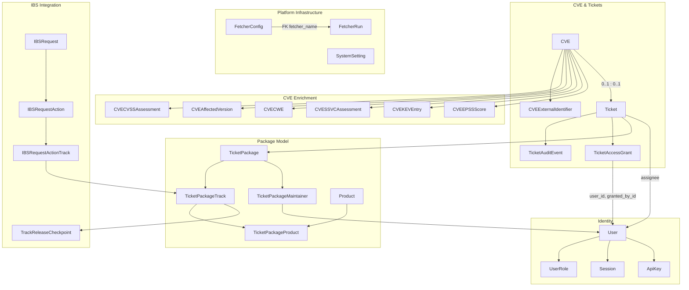
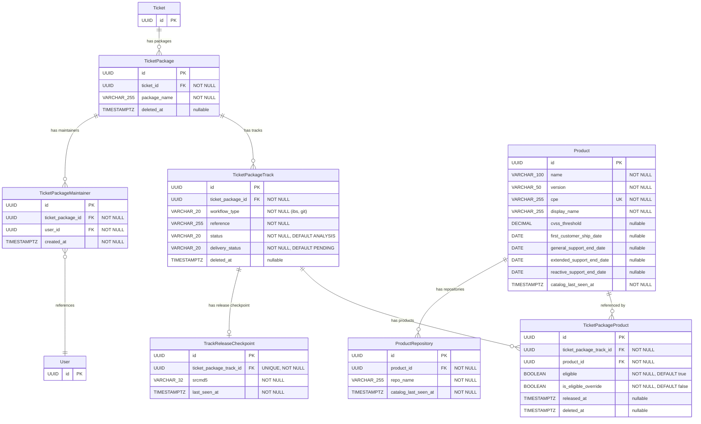
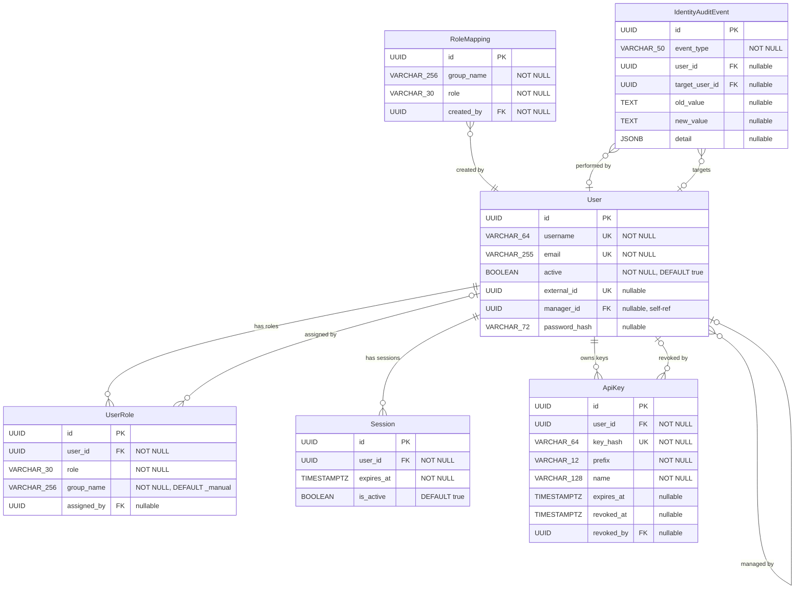
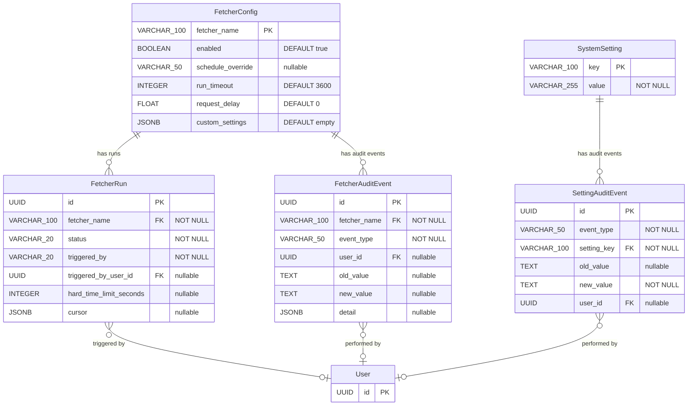
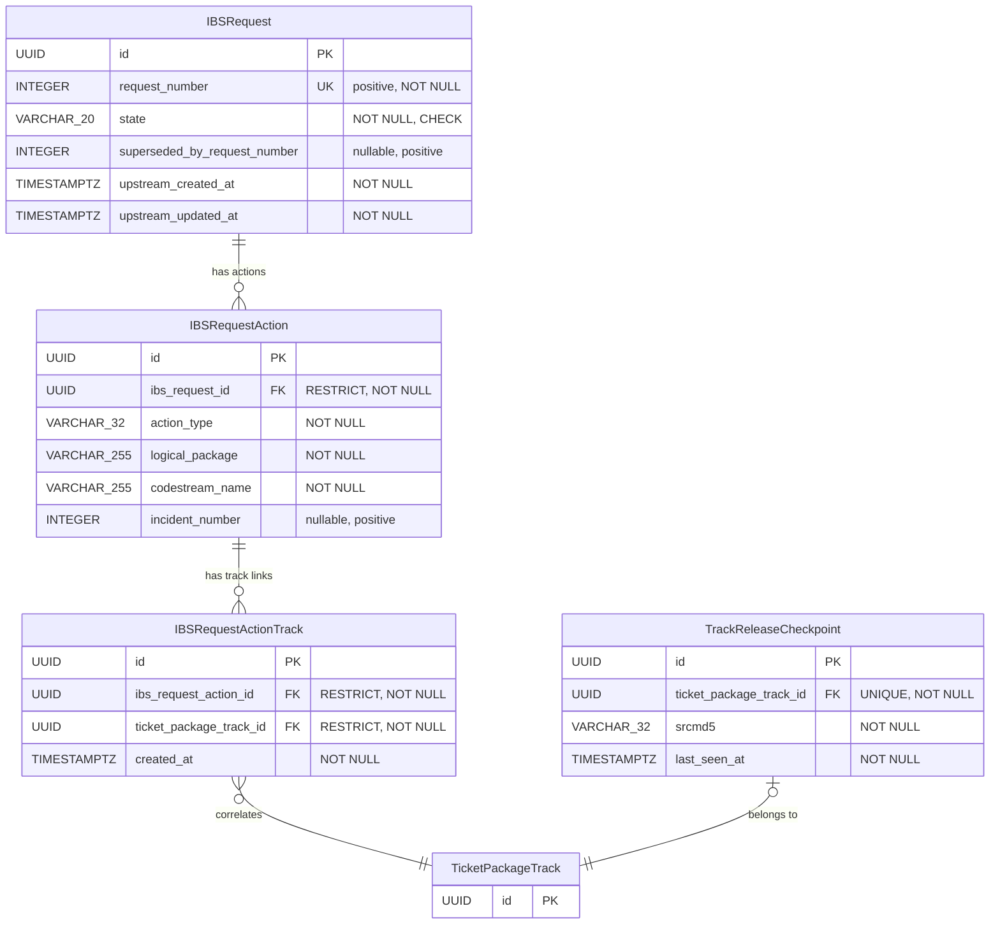

```mermaid
erDiagram
    CVE {
        UUID id PK
        VARCHAR_20 cve_id UK "NOT NULL"
        VARCHAR_20 severity "nullable"
        VARCHAR_20 cve_state "NOT NULL, DEFAULT PUBLISHED"
        TIMESTAMPTZ date_rejected "nullable"
    }
    CVESource {
        UUID id PK
        UUID cve_id FK "NOT NULL"
        VARCHAR_100 source "NOT NULL"
        VARCHAR_20 status "NOT NULL"
    }
    CVECVSSAssessment {
        UUID id PK
        UUID cve_id FK "NOT NULL"
        VARCHAR_100 provider_name "NOT NULL"
        VARCHAR_10 cvss_version "NOT NULL"
        DECIMAL score "NOT NULL"
    }
    CVEExternalIdentifier {
        UUID id PK
        UUID cve_id FK "NOT NULL"
        VARCHAR_20 source "NOT NULL"
        VARCHAR_100 identifier "NOT NULL"
    }
    CVEAffectedVersion {
        UUID id PK
        UUID cve_id FK "NOT NULL"
        VARCHAR_100 source_container "NOT NULL"
        VARCHAR_255 vendor "nullable"
        TEXT product "nullable"
    }
    CVECWE {
        UUID id PK
        UUID cve_id FK "NOT NULL"
        VARCHAR_20 cwe_id "NOT NULL"
        VARCHAR_100 source "NOT NULL"
    }
    CVESSVCAssessment {
        UUID id PK
        UUID cve_id FK "UNIQUE, NOT NULL"
        VARCHAR_20 exploitation "NOT NULL"
    }
    CVEKEVEntry {
        UUID id PK
        UUID cve_id FK "UNIQUE, NOT NULL"
        DATE date_added "NOT NULL"
    }
    CVEEPSSScore {
        UUID id PK
        UUID cve_id FK "UNIQUE, NOT NULL"
        FLOAT score "NOT NULL"
        FLOAT percentile "NOT NULL"
    }
    Ticket {
        UUID id PK
        INTEGER sequence_id UK "auto-increment"
        UUID cve_id FK "UNIQUE, nullable"
        VARCHAR_20 status "NOT NULL"
        VARCHAR_20 severity_manual "nullable"
        BOOLEAN is_confidential "NOT NULL, DEFAULT FALSE"
        UUID assignee_id FK "nullable"
         UUID duplicate_of_id FK "self-ref, nullable"
    }
    TicketAccessGrant {
        UUID ticket_id PK,FK "NOT NULL"
        UUID user_id PK,FK "NOT NULL"
        UUID granted_by_id FK "NOT NULL"
        TIMESTAMPTZ granted_at "NOT NULL"
    }
    TicketAuditEvent {
        UUID id PK
        UUID ticket_id FK "NOT NULL"
        UUID user_id FK "nullable"
        VARCHAR_50 event_type "NOT NULL"
        TEXT old_value "nullable"
        TEXT new_value "nullable"
        TEXT comment "nullable"
        JSONB detail "nullable"
    }
    TicketReference {
        UUID id PK
        UUID ticket_id FK "NOT NULL"
        VARCHAR_2048 url "NOT NULL"
        VARCHAR_20 type "nullable"
        VARCHAR_100 source "NOT NULL"
    }
    User {
        UUID id PK
    }

    CVE ||--o{ CVESource : "has sources"
    CVE ||--o{ CVECVSSAssessment : "has assessments"
    CVE ||--o{ CVEExternalIdentifier : "has external identifiers"
    CVE ||--o{ CVEAffectedVersion : "has affected versions"
    CVE ||--o{ CVECWE : "has weaknesses"
    CVE ||--o| CVESSVCAssessment : "has SSVC assessment"
    CVE ||--o| CVEKEVEntry : "is in KEV catalog"
    CVE ||--o| CVEEPSSScore : "has EPSS score"
    CVE |o--o| Ticket : "tracked by"
    Ticket ||--o{ TicketAccessGrant : "has access grants"
    Ticket ||--o{ TicketAuditEvent : "has events"
    Ticket ||--o{ TicketReference : "has references"
    Ticket }o--o| User : "assigned to"
    Ticket }o--o| Ticket : "duplicate of"
    TicketAccessGrant }o--|| User : "granted to"
    TicketAccessGrant }o--|| User : "granted by"
    TicketAuditEvent }o--o| User : "performed by"
```

# Data Model

This document describes the database schema for Sentinel. All models are
implemented as SQLAlchemy ORM classes in `backend/app/models/`.

## Contents

- [Entity Relationship Overview](#entity-relationship-overview)
  - [Overview](#overview)
  - [CVE & Ticket Core](#cve--ticket-core)
  - [Package Model](#package-model)
  - [Identity](#identity)
  - [Platform Infrastructure](#platform-infrastructure)
  - [IBS Integration](#ibs-integration)
- [Tables](#tables)
  - [Shared Structures](#shared-structures)
  - [CVE & Ticket Core](#cve--ticket-core-1)
  - [Package Model](#package-model-1)
  - [Identity](#identity-1)
  - [Platform Infrastructure](#platform-infrastructure-1)
  - [IBS Integration](#ibs-integration-1)
- [Notes](#notes)

## Entity Relationship Overview

The data model comprises 34 entities organized into five domains. The
overview below shows the core entities and their cross-domain
relationships. Domain-specific diagrams follow with key columns (primary
keys, foreign keys, and discriminant fields). Full column definitions
are in the [Tables](#tables) section.

Entities from other domains appear as stubs (primary key only) in domain
diagrams when referenced by a foreign key. Dashed lines indicate
implicit relationships (joined by convention, no FK constraint).

### Overview



### CVE & Ticket Core



### Package Model



### Identity



### Platform Infrastructure



### IBS Integration



## Tables

### Shared Structures

This section documents shared SQLAlchemy structures that are not
physical database tables.

#### AuditEventMixin

Shared SQLAlchemy mixin inherited by all audit event models. Provides
the common columns for every audit trail table. See
`docs/features/platform/audit-trail-infrastructure.md` for the full
specification.

| Column | Type | Constraints | Description |
|---|---|---|---|
| id | UUID | PK | Internal identifier |
| created_at | TIMESTAMPTZ | NOT NULL, server default, indexed | When the event occurred |
| user_id | UUID | FK(user.id) ON DELETE RESTRICT, nullable, indexed | Actor who performed the action. NULL for system-initiated actions |

**Location**: `backend/app/models/mixins.py`

All audit event models below inherit these columns from the mixin and
add their own domain-specific columns.

### CVE & Ticket Core
#### CVE

Represents a Common Vulnerability and Exposure entry.

| Column         | Type         | Constraints          | Description                     |
|----------------|--------------|----------------------|---------------------------------|
| id             | UUID         | PK                   | Internal identifier             |
| cve_id         | VARCHAR(20)  | UNIQUE, NOT NULL     | CVE identifier (e.g., CVE-2024-1234) |
| title          | VARCHAR(256) |                      | Brief summary from the CNA (CVE 5.x `containers.cna.title`). Populated by fetchers that parse CVE JSON 5.x format (`sync_mitre_cves`, `sync_kernel_cves`). Null when the CNA does not provide a title. Max 256 chars per CVE schema specification |
| description    | TEXT         |                      | Vulnerability description       |
| severity       | VARCHAR(20)  | nullable               | Critical, High, Medium, Low, None — denormalized field, always derived from CVSS assessments via the resolution cascade (see `docs/features/tickets/cvss-scoring.md`). `NULL` when no CVSS assessment is available from any provider (unresolved). `None` is a valid severity value representing a CVSS score of exactly 0.0 (the standard CVSS "None" rating). Recalculated whenever CVSS assessments change or the default CVSS version is modified. |
| published_date | TIMESTAMPTZ    |                      | Date CVE was published         |
| modified_date  | TIMESTAMPTZ    |                      | Date CVE was last modified     |
| cve_state      | VARCHAR(20)  | NOT NULL, DEFAULT PUBLISHED | CveState: PUBLISHED, REJECTED. Populated by any discovery fetcher: `sync_mitre_cves` (from `cveMetadata.state`), `sync_nvd_cves` (from `vulnStatus = Rejected`), `sync_kernel_cves` (from file path: `published/` vs `rejected/`). See `docs/features/tickets/cve-tracking.md` for rejection handling rules |
| date_rejected  | TIMESTAMPTZ  | nullable             | From CVE JSON 5.x `cveMetadata.dateRejected`. Set when `cve_state` transitions to `REJECTED`, cleared when it reverts to `PUBLISHED` |
| created_at     | TIMESTAMPTZ    | NOT NULL, DEFAULT    | Record creation timestamp      |
| updated_at     | TIMESTAMPTZ    | NOT NULL, DEFAULT    | Record update timestamp        |

#### CveState Enum

CVE record state. Category A — state-machine (VARCHAR + CHECK constraint
`chk_cve_cve_state_valid`). Adding a value requires an Alembic
migration. Stable value set defined by the CVE Program.

| Value | Description |
|-------|-------------|
| `PUBLISHED` | CVE record is published and active |
| `REJECTED` | CVE record has been rejected by the CNA |

#### CVESource

Tracks the fetch outcome for each CVE data source. One record per source
per CVE. Most sources write records for all outcomes (success, failure,
missing). Some sources write only `success` records; their `failure` and
`missing` statuses are derived at read time from other data (e.g., KEV
derives status from `CVEKEVEntry` presence — see
`docs/features/tickets/cve-service.md` for the derivation logic).
See `docs/features/tickets/cve-service.md`.

| Column      | Type          | Constraints                        | Description                        |
|-------------|---------------|------------------------------------|------------------------------------|
| id          | UUID          | PK                                 | Internal identifier                |
| cve_id      | UUID          | FK(cve.id) ON DELETE CASCADE, NOT NULL | Related CVE                   |
| source      | VARCHAR(100)  | NOT NULL                           | Provider identifier (e.g., `"nvd"`, `"mitre"`, `"kernel"`, `"redhat"`). Stored as lowercase. The valid values are defined by the `CVESourceType` Python Enum in `app/core/enums.py` (evolving value set — new sources are added as the ingestion pipeline expands). Column is VARCHAR(100) — Category B classification enum. Note: despite the shared column name `source`, each table uses a different value format. `CVESource.source` stores CVESourceType identifiers (lowercase, e.g., `"nvd"`). `CVEExternalIdentifier.source` stores naming authority labels (VARCHAR, Python Enum, e.g., `GHSA`). `CVECWE.source` stores provider names (mixed case, e.g., `"NVD"`, `"Red Hat"`). `TicketReference.source` stores `BaseFetcher.name` (e.g., `"sync_nvd_cves"`) or `"manual"` |
| status      | VARCHAR(20)   | NOT NULL                           | Fetch outcome: `success` (data written), `failure` (retries exhausted), `missing` (CVE not in source). CVESourceFetchStatus — validated by Python Enum in `app/core/enums.py` (Category B — classification). No default — always written explicitly by the caller |
| fetched_at  | TIMESTAMPTZ   | NOT NULL                           | Timestamp of the last fetch attempt (success, failure, or missing) |
| first_failed_at | TIMESTAMPTZ | nullable                          | Timestamp when the current failure streak began. Set to now() on first transition to failure (when currently NULL). Preserved on subsequent failure writes. Cleared to NULL on success or missing writes. See `docs/features/tickets/cve-service.md` (`record_source_status`) for write semantics and `docs/features/platform/cve-source-failure-retry.md` for the retry mechanism |
| created_at  | TIMESTAMPTZ   | NOT NULL, DEFAULT                  | Record creation timestamp          |
| updated_at  | TIMESTAMPTZ   | NOT NULL, DEFAULT                  | Record update timestamp            |

**Unique constraint**: (cve_id, source)

**Derived predicate — "stalled"**: `status = 'failure' AND
first_failed_at < now() - 30 days`. Not a stored column, ENUM value, or
API status field value — a query-time predicate. See
`docs/features/platform/cve-source-failure-retry.md` for consumers,
threshold rationale, and operational guidance.

#### CVESourceFetchStatus Enum

Outcome of a CVE data fetch attempt from an external source. Category B
— classification enum (Python Enum in `app/core/enums.py`, no CHECK
constraint). Adding a new status requires only a code change.

| Value | Description |
|-------|-------------|
| `success` | Fetcher ran and wrote data successfully |
| `failure` | Fetcher ran, exhausted retries, and could not retrieve data |
| `missing` | Fetcher ran, source responded, but CVE does not exist in that source |

#### CVESourceType Python Enum

"CVESourceType" is the formal term for the short lowercase provider
labels stored in `CVESource.source`. Category B — classification enum
(Python Enum in `app/core/enums.py`, no CHECK constraint). The database
column is `VARCHAR(100)`. Adding a new source requires only a code
change.

| Value | Description |
|-------|-------------|
| `"nvd"` | NIST National Vulnerability Database |
| `"mitre"` | MITRE CVE Services (cvelistV5 repository) |
| `"kernel"` | Linux kernel vulnerability tracker (vulns.git) |
| `"redhat"` | Red Hat Security Data API |
| `"ghsa"` | GitHub Advisory Database (GitHub CNA) |
| `"osv"` | OSV (osv.dev) — aggregated ecosystem advisory data |
| `"kev"` | CISA Known Exploited Vulnerabilities catalog |
| `"epss"` | FIRST EPSS (Exploit Prediction Scoring System) |

**Format constraint**: values MUST match `[a-z][a-z0-9_]*` and not
exceed 100 characters (matching the `CVESource.source` VARCHAR(100)
column constraint). Enforced by a unit test on the Enum definition.

**Adding a new value**: requires two steps:
1. Add the value to the `CVESourceType` Enum in `app/core/enums.py`
2. Declare `cve_source_type` on the corresponding `BaseCVEFetcher` subclass

See `docs/features/platform/cve-fetcher-infrastructure.md` ("CVE Source Type
Identity") for the full contract including import-time validation,
stability rules, and the `get_fetch_single_fetchers()` accessor.

Not to be confused with `BaseFetcher.name` (the fetcher registry key,
e.g., `"sync_nvd_cves"`), which is a different identifier type stored
in `TicketReference.source` and `FetcherRun.fetcher_name`.

#### CVECVSSAssessment

Stores individual CVSS assessments from multiple providers for each CVE.
A CVE can have assessments from NVD, CNA vendors, Red Hat, and SUSE (VA
input). Each provider may supply assessments for multiple CVSS versions.
See `docs/features/tickets/cvss-scoring.md` for the full specification.

| Column        | Type          | Constraints                            | Description                        |
|---------------|---------------|----------------------------------------|------------------------------------|
| id            | UUID          | PK                                     | Internal identifier                |
| cve_id        | UUID          | FK(cve.id) ON DELETE CASCADE, NOT NULL | Related CVE                        |
| provider_name | VARCHAR(100) | NOT NULL                               | Human-readable provider name (e.g., `"NVD"`, `"Intel Corporation"`, `"Red Hat"`, `"SUSE"`) |
| cvss_version  | VARCHAR(10)   | NOT NULL                               | CVSS version (e.g., `"3.1"`, `"4.0"`, `"2.0"`) |
| score         | DECIMAL(3,1)  | NOT NULL                               | Calculated base score (0.0-10.0)   |
| severity      | VARCHAR(10)   | NOT NULL                               | Qualitative severity derived from vector string: `"none"`, `"low"`, `"medium"`, `"high"`, `"critical"` (stored lowercase) |
| vector_string | VARCHAR(200)  | NOT NULL                               | Full CVSS vector string            |
| created_at    | TIMESTAMPTZ     | NOT NULL, DEFAULT                      | Record creation timestamp          |
| updated_at    | TIMESTAMPTZ     | NOT NULL, DEFAULT                      | Record update timestamp            |

**Unique constraint**: (cve_id, provider_name, cvss_version)

**Notes**:
- `provider_name` for NVD Primary assessments is always `"NVD"`
- `provider_name` for NVD Secondary (CNA) assessments is resolved from the
  NVD Source API to a human-readable name (e.g., `"Intel Corporation"`)
- `provider_name` for the SUSE internal assessment is always `"SUSE"`
- `severity` is derived from the vector string using the `cvss` Python
  library's `.severities()[0]` method — never accepted as external input.
  The library returns title-case labels (e.g., `"Critical"`); these are
  normalized to lowercase before storage (e.g., `"critical"`). The library
  applies the version-specific FIRST qualitative rating scale: CVSS v2
  vectors produce labels from {low, medium, high}; v3/v4 vectors produce
  labels from {none, low, medium, high, critical}. This per-assessment
  severity is distinct from `CVE.severity`, which uses a unified scale for
  operational prioritization (see `docs/features/tickets/cvss-scoring.md`)
- When a direct source (e.g., Red Hat API) provides data that also exists
  as an NVD Secondary, both write to the same UPSERT conflict key
  `(cve_id, provider_name, cvss_version)` — last-writer-wins. Since all
  fetchers run on regular schedules, data converges to the most recent
  value within one cycle

#### CVEExternalIdentifier

Tracks external vulnerability identifiers (e.g., GHSA-ID) mapped to a
CVE by their respective naming authority. External identifiers are
populated exclusively by fetchers — there is no user-facing CRUD. The
CVE remains the sole canonical identifier in Sentinel.

| Column     | Type                                   | Constraints             | Description                              |
|------------|----------------------------------------|-------------------------|------------------------------------------|
| id         | UUID                                   | PK                      | Internal identifier                      |
| cve_id     | UUID                                   | FK(cve.id) ON DELETE CASCADE, NOT NULL | Related CVE                |
| source     | VARCHAR(20)                            | NOT NULL                | Naming authority (e.g., `GHSA`, `PYSEC`, `RUSTSEC`). Valid values defined by the `CVEExternalIdentifierSource` Python Enum in `app/core/enums.py` (evolving value set). Column is VARCHAR(20) — Category B classification enum |
| identifier | VARCHAR(100)                           | NOT NULL                | External ID (e.g., `GHSA-xxxx-xxxx-xxxx`) |
| url        | TEXT                                   | nullable                | Direct link to the advisory page         |
| created_at | TIMESTAMPTZ                            | NOT NULL, DEFAULT       | Record creation timestamp                |
| updated_at | TIMESTAMPTZ                            | NOT NULL, DEFAULT       | Record update timestamp                  |

**Unique constraint**: (source, identifier) — each external ID is
globally unique within its naming system.

**Notes**:
- A CVE can have multiple external identifiers from different sources
  (e.g., one GHSA-ID and one RUSTSEC-ID)
- A CVE can also have multiple identifiers from the same source (rare,
  but possible when multiple advisories map to one CVE)
- External identifiers persist regardless of ticket status or existence
- The `url` column stores the canonical advisory URL for UI convenience
  (e.g., `https://github.com/advisories/GHSA-xxxx-xxxx-xxxx`)

#### CVEExternalIdentifierSource Python Enum

Identifies the naming authority that assigned an external vulnerability
identifier. Category B — classification enum (Python Enum in
`app/core/enums.py`, no CHECK constraint). The database column is
`VARCHAR(20)`. Adding a new source requires only a code change.

| Value | Description |
|-------|-------------|
| `GHSA` | GitHub Security Advisory identifier |
| `PYSEC` | Python Security Advisory (PyPI) identifier |
| `RUSTSEC` | Rust Security Advisory (crates.io) identifier |

**Format constraint**: values MUST match `[A-Z][A-Z0-9_]*` and not
exceed 20 characters (matching the `CVEExternalIdentifier.source`
VARCHAR(20) column constraint). Enforced by a unit test on the Enum
definition.

**Adding a new value**: add the value to the `CVEExternalIdentifierSource`
Enum in `app/core/enums.py`. No Alembic migration required.

#### CVEAffectedVersion

Stores affected product/version information from CVE JSON 5.x
`affected[]` arrays. Populated by multiple fetchers (both discovery
and enrichment). When `version_type = "git"`, the `version` field
contains the introducing commit SHA and `version_end` contains the
fixing commit SHA — making kernel commit tracking a natural subset of
the general affected version model. See
`docs/features/tickets/cve-service.md`.

| Column | Type | Constraints | Description |
|--------|------|-------------|-------------|
| id | UUID | PK | Internal identifier |
| cve_id | UUID | FK(cve.id) ON DELETE CASCADE, NOT NULL | Parent CVE |
| source_container | VARCHAR(100) | NOT NULL | Provenance: `"cna"`, `"adp:CISA-ADP"`, etc. Scope key for delete-and-reinsert — see fetcher contract in `docs/features/tickets/cve-service.md` (Child Table Deduplication). Both MITRE and kernel fetchers write `"cna"` (same CNA data) |
| vendor | VARCHAR(255) | nullable | Vendor name (e.g., "Linux", "Siemens") |
| product | TEXT | nullable | Product name (e.g., "Linux", "SCALANCE XC-300"). TEXT because some CNAs list entire product families in this field |
| package_url | TEXT | nullable | PURL identifier (CVE 5.2.0+). Useful for identifying vendored dependencies (npm, PyPI, Go) inside SUSE RPMs |
| collection_url | TEXT | nullable | Package registry URL (npm, PyPI, etc.). Pre-PURL mechanism, still used by many CNAs |
| package_name | VARCHAR(255) | nullable | Source package name. From CNA `packageName` field — may be an RPM source package name (Red Hat, SUSE, Fedora CNAs), a registry package name paired with `collection_url`, or a vendor-specific identifier |
| repo | TEXT | nullable | Source code repository URL |
| version | TEXT | nullable | Single version or range start. TEXT because some CNAs list model numbers or multi-range values |
| version_type | VARCHAR(50) | nullable | `"semver"` / `"git"` / `"custom"` / `"original_commit_for_fix"` / `"rpm"` / ... |
| version_end | TEXT | nullable | Range end (`lessThan` or `lessThanOrEqual`). TEXT for same reason as `version` |
| version_end_inclusive | BOOLEAN | nullable | `true` for `lessThanOrEqual`, `false` for `lessThan` |
| program_files | JSONB | nullable | Array of affected source files (embedded, not a separate table — used primarily for kernel CVEs, display-only) |
| cpe | VARCHAR(255) | nullable | CNA/ADP-provided CPE from `affected[]` array. Used for best-effort package resolution in Phase 2 (see `docs/features/tickets/cve-service.md`), alongside NVD CPE package candidates selected by the NVD ingestion contract and passed via `cpe_matches`. Both feed the same `resolve_cpe_packages()` function |
| ecosystem | VARCHAR(50) | nullable | OSV/OSSF canonical ecosystem identifier. Sentinel uses the [OSSF OSV Schema](https://ossf.github.io/osv-schema/) ecosystem enumeration as its internal standard for this field (e.g., `"PyPI"`, `"npm"`, `"Go"`, `"crates.io"`, `"Maven"`, `"NuGet"`, `"RubyGems"`, `"Packagist"`). Fetchers that receive canonical OSSF values (e.g., `sync_osv_advisories`) store them as-is. Fetchers that receive non-canonical names from their upstream source (e.g., `sync_ghsa_advisories` receives GitHub's `"pip"` instead of `"PyPI"`) MUST normalize to OSSF canonical values before storage — see the owning fetcher spec for the specific mapping. NULL for fetchers whose upstream source has no ecosystem concept (NVD, MITRE, Red Hat, Kernel). See `docs/conventions.md` (Ecosystem Naming) for the cross-cutting convention |
| status | VARCHAR(20) | nullable | Version-level vulnerability status from `versions[].status`. Known values: `"affected"`, `"unaffected"`, `"unknown"`. NULL for entries created without `versions[]` (parser step 4). Stored as-is without validation |
| default_status | VARCHAR(20) | nullable | Entry-level baseline status from `affected[].defaultStatus`. Same value set as `status`. NULL when absent from source JSON (semantically equivalent to `"unknown"` per CVE 5.x schema). Shared by all version entries from the same parent `affected[]` entry |
| created_at | TIMESTAMPTZ | NOT NULL, DEFAULT | Record creation timestamp |

Records are replaced (delete-and-reinsert per `(cve_id,
source_container)`), never updated in place — only `created_at` is
included (no `updated_at`).

**Deduplication**: delete-and-reinsert per `(cve_id, source_container)`.
Each `upsert_cve()` call deletes all existing rows for the given
`(cve_id, source_container)` and inserts the complete set from the
payload. This is a documented exception to the `ON CONFLICT DO UPDATE`
pattern used by other child tables (`CVECWE`, `CVECVSSAssessment`,
etc.). Those tables have stable record identity — individual records
persist and are updated in place. `CVEAffectedVersion` has snapshot
semantics — the entire set is replaced per source on each sync.

**Safety-net unique constraint** (for data integrity, not used for
`ON CONFLICT`):

```sql
UNIQUE (cve_id, source_container, vendor, product,
        COALESCE(version_type, ''), COALESCE(version, ''),
        COALESCE(version_end, ''), COALESCE(package_name, ''))
```

Note: `ecosystem`, `status`, and `default_status` are intentionally
excluded from the unique constraint. `ecosystem`: the same package in
different ecosystems from different sources is valid (e.g., `"jinja2"`
from OSV with `ecosystem = "PyPI"` and from GHSA with
`ecosystem = "PyPI"` share a `source_container` and are replaced
together). `status` and `default_status`: these are informational
properties of the entry, not identity — two entries differing only in
status would be semantically contradictory. Different
`source_container` values independently own their own set of rows.

#### CVECWE

Stores CWE (Common Weakness Enumeration) identifiers from multiple
providers. Different providers (NVD, CNA, CISA-ADP, Red Hat) frequently
assign different CWE IDs to the same CVE. Provenance tracking has value
for VA triage.

| Column | Type | Constraints | Description |
|--------|------|-------------|-------------|
| id | UUID | PK | Internal identifier |
| cve_id | UUID | FK(cve.id) ON DELETE CASCADE, NOT NULL | Parent CVE |
| cwe_id | VARCHAR(20) | NOT NULL | CWE identifier (e.g., "CWE-79") |
| source | VARCHAR(100) | NOT NULL | Provider (e.g., "NVD", "cna:Linux", "adp:CISA-ADP", "Red Hat") |
| created_at | TIMESTAMPTZ | NOT NULL, DEFAULT | Record creation timestamp |
| updated_at | TIMESTAMPTZ | NOT NULL, DEFAULT | Record update timestamp |

**Unique constraint**: (cve_id, cwe_id, source)

#### CVESSVCAssessment

Stores CISA SSVC (Stakeholder-Specific Vulnerability Categorization)
decision points. Although CISA is currently the only SSVC provider
(1:1 with CVE), a dedicated table isolates the domain cleanly.

| Column | Type | Constraints | Description |
|--------|------|-------------|-------------|
| id | UUID | PK | Internal identifier |
| cve_id | UUID | FK(cve.id) ON DELETE CASCADE, UNIQUE, NOT NULL | Parent CVE (one SSVC assessment per CVE) |
| exploitation | VARCHAR(20) | NOT NULL | `"none"` / `"poc"` / `"active"` |
| automatable | VARCHAR(10) | NOT NULL | `"no"` / `"yes"` |
| technical_impact | VARCHAR(20) | NOT NULL | `"partial"` / `"total"` |
| version | VARCHAR(10) | NOT NULL | SSVC version (e.g., "2.0.3") |
| assessed_at | TIMESTAMPTZ | nullable | When the assessment was performed |
| created_at | TIMESTAMPTZ | NOT NULL, DEFAULT | Record creation timestamp |
| updated_at | TIMESTAMPTZ | NOT NULL, DEFAULT | Record update timestamp |

#### CVEKEVEntry

Stores CISA Known Exploited Vulnerabilities catalog data. Although it
is a 1:1 relationship with CVE, isolating KEV data keeps the CVE table
lean and gives the `sync_cisa_kev` fetcher a clean upsert target.

| Column | Type | Constraints | Description |
|--------|------|-------------|-------------|
| id | UUID | PK | Internal identifier |
| cve_id | UUID | FK(cve.id) ON DELETE CASCADE, UNIQUE, NOT NULL | Parent CVE (one KEV entry per CVE) |
| date_added | DATE | NOT NULL | Date added to KEV catalog |
| reference_url | TEXT | nullable | URL to KEV catalog entry |
| created_at | TIMESTAMPTZ | NOT NULL, DEFAULT | Record creation timestamp |
| updated_at | TIMESTAMPTZ | NOT NULL, DEFAULT | Record update timestamp |

#### CVEEPSSScore

Stores the latest FIRST EPSS (Exploit Prediction Scoring System) score
for each CVE. This is a **point-in-time snapshot** (one row per CVE),
not a time series — the record is overwritten on each daily sync.

| Column | Type | Constraints | Description |
|--------|------|-------------|-------------|
| id | UUID | PK | Internal identifier |
| cve_id | UUID | FK(cve.id) ON DELETE CASCADE, UNIQUE, NOT NULL | Parent CVE (one EPSS entry per CVE) |
| score | FLOAT | NOT NULL | Probability score (0.0 to 1.0) |
| percentile | FLOAT | NOT NULL | Percentile rank (0.0 to 1.0) |
| assessed_at | DATE | NOT NULL | Date of the EPSS assessment |
| created_at | TIMESTAMPTZ | NOT NULL, DEFAULT | Record creation timestamp |
| updated_at | TIMESTAMPTZ | NOT NULL, DEFAULT | Record update timestamp |

**FLOAT vs DECIMAL**: EPSS scores use `FLOAT` instead of the
`DECIMAL(3,1)` used by `CVECVSSAssessment.score`. CVSS scores are
used for threshold comparisons that gate eligibility decisions, where
floating-point imprecision could cause incorrect results (e.g.,
6.999... vs 7.0). EPSS scores are informational — displayed to VAs
but not used for automated threshold decisions. Additionally, EPSS
values have variable precision (e.g., 0.00043, 0.97565) that would
require a wide DECIMAL scale.

**Lifecycle**: the `sync_epss_scores` fetcher refreshes EPSS data only for
CVEs with **active tickets** (New, Analysis, Analyzed). When a ticket
transitions to an inactive status, the CVEEPSSScore record is **retained**
but no longer refreshed — consistent with the CVSS lifecycle pattern
(`docs/features/tickets/cvss-scoring.md`, Sync Scope). If the ticket later
returns to an active status, the fetcher resumes refreshing the record on
its next run.

See `docs/features/tickets/cve-sync-epss.md` for display guidance.

#### Ticket

Represents the internal workflow unit for a security issue. A ticket may
optionally be associated with a CVE (0..1:1 relationship). Tickets track
the triage and resolution lifecycle managed by vulnerability analysts (VAs).
See `docs/features/tickets/tickets.md` for the full ticket specification.

| Column            | Type        | Constraints                  | Description                          |
|-------------------|-------------|------------------------------|--------------------------------------|
| id                | UUID        | PK                           | Internal identifier                  |
| sequence_id       | INTEGER     | UNIQUE, NOT NULL, auto-increment | Human-readable ticket ID, exposed as `SNTL-{n}` (e.g., `SNTL-42`) |
| cve_id            | UUID        | FK(cve.id), UNIQUE, nullable | Associated CVE. NULL for tickets created without a CVE. A CVE can be associated later via `POST /api/v1/tickets/{ticket_id}/associate-cve` |
| status            | VARCHAR(20) | NOT NULL, DEFAULT New        | TicketStatus: New, Analysis, Analyzed, Resolved, Ignored, Duplicated |
| severity_manual | VARCHAR(20) | nullable                     | Manual severity set by the VA (Critical, High, Medium, Low, None). `NULL` = not set (unresolved). `None` = VA explicitly assessed as informational (equivalent to CVSS score 0.0). Used for severity resolution when `cve_id IS NULL`. Cannot be set when `cve_id IS NOT NULL` (severity is derived from CVSS). Cleared to `NULL` by `associate_cve` when a CVE is linked. Mutually exclusive with `cve_id` (see CHECK below). See `docs/features/tickets/tickets.md` (Severity Resolution) |
| assignee_id       | UUID        | FK(user.id), nullable        | VA currently assigned to this ticket |
| duplicate_of_id   | UUID        | FK(ticket.id), nullable      | Self-referencing FK to the target ticket when status is Duplicated. Always references a non-Duplicated ticket (enforced by the transactional locking protocol in `mark_as_duplicate`). See `docs/features/tickets/tickets.md` (Duplicate Handling) |
| created_at        | TIMESTAMPTZ   | NOT NULL, DEFAULT            | Record creation timestamp            |
| updated_at        | TIMESTAMPTZ   | NOT NULL, DEFAULT            | Record update timestamp              |
| is_confidential   | BOOLEAN       | NOT NULL, DEFAULT FALSE      | When TRUE, access is restricted to authorized users only. See `docs/features/tickets/tickets.md` (Confidential Tickets) |

**CHECK constraints**:

- `chk_ticket_duplicate_status_coherence`: `(status = 'Duplicated' AND duplicate_of_id IS NOT NULL) OR (status != 'Duplicated' AND duplicate_of_id IS NULL)`
- `chk_ticket_no_self_duplicate`: `duplicate_of_id <> id`
- `chk_ticket_severity_manual_cve_exclusive`: `severity_manual IS NULL OR cve_id IS NULL`

**Indexes**:

- `ix_ticket_duplicate_of_id`: partial index on `duplicate_of_id` WHERE
  `duplicate_of_id IS NOT NULL` — supports `mark_as_duplicate` finding
  dependents of the source ticket.

**Deletion policy**: Tickets MUST NOT be deleted from the database. There is no soft-delete mechanism at the ticket level. Tickets that are no longer relevant are transitioned to Ignored or Duplicated status.

**Status transitions**: see `docs/features/tickets/tickets.md` (Ticket Lifecycle)
for the full transition diagram, gates, and rules.

Summary:
- New -> Analysis (manual: assignment or any modifying operation)
- New -> Ignored (manual or automatic: CVE rejection)
- Analysis -> Analyzed (automatic: all gates met — at least one package,
  no track records in ANALYSIS, severity set, SUSE CVSS
  provided if CVE present)
- Analysis -> Ignored (manual)
- Analyzed -> Resolved (automatic: all tracks resolution-complete)
- Analyzed -> Analysis (automatic: gate conditions no longer met)
- Resolved -> Analyzed (automatic: resolved gates broken, analyzed gates
  still met)
- Resolved -> Analysis (automatic: both resolved and analyzed gates
  broken)
- Any except Ignored and Duplicated -> Duplicated (manual, reversible)
- Duplicated -> (evaluated status) (manual: revert via
  `_reenter_gate_zone`; reassigns to the reverting VA)
- Ignored -> (evaluated status) (manual: VA assigns; or automatic:
  system reopens via `_reenter_gate_zone`)

Forward and reverse transitions between Analysis, Analyzed, and Resolved
are handled automatically by the `ticket_mutations` module — see
`docs/features/tickets/ticket-mutations.md`.
Exits from the manual zone (Ignored, Duplicated) use the shared
`_reenter_gate_zone` helper which sets `status = Analysis` (floor of
the gate zone) and calls `reconcile_ticket_status`, which may promote
further to `Analyzed` or `Resolved` if gate conditions are satisfied.

**Status categories**:
- **Active tickets**: tickets in status `New`, `Analysis`, or `Analyzed`.
  These are actively monitored: CVSS
   sync, release detection, and recalculation chains apply to active
   tickets.
- **Inactive tickets**: tickets in status `Resolved`, `Ignored`, or
  `Duplicated`. These are no longer monitored: CVSS sync and
   recalculation chains skip inactive tickets.

#### TicketStatus Enum

Ticket lifecycle status. Category A — state-machine (VARCHAR + CHECK
constraint `chk_ticket_status_valid`). Adding a value requires an
Alembic migration.

| Value | Description |
|-------|-------------|
| `New` | Newly created ticket, no analysis started |
| `Analysis` | Under active analysis by a VA |
| `Analyzed` | All analysis gates met; awaiting resolution |
| `Resolved` | All tracks resolution-complete |
| `Ignored` | Ticket dismissed (e.g., not applicable, CVE rejected) |
| `Duplicated` | Ticket marked as duplicate of another ticket |

See `docs/features/tickets/tickets.md` (Ticket Lifecycle) for the full
transition diagram, gates, and rules.

#### TicketReference

Stores external links associated with a ticket. References are created
automatically by CVE fetchers during ingestion and can also be added
manually by users with the `manage_references` capability. See
`docs/features/tickets/ticket-references.md` for the full specification.

| Column      | Type                       | Constraints                  | Description                        |
|-------------|----------------------------|------------------------------|------------------------------------|
| id          | UUID                       | PK                           | Internal identifier                |
| ticket_id   | UUID                       | FK(ticket.id) ON DELETE CASCADE, NOT NULL | Related ticket                     |
| url         | VARCHAR(2048)              | NOT NULL                     | URL of the external resource. Stored in normalized form: scheme + host lowercased, `http` upgraded to `https`, empty trailing slash removed (see `docs/features/tickets/ticket-references.md`, Upsert Strategy § URL Normalization) |
| title       | VARCHAR(500)               | nullable                     | Human-readable label               |
| description | VARCHAR(2000)              | nullable                     | Short note explaining relevance    |
| type        | VARCHAR(20)                | nullable                     | Content classification. NULL = uncategorized |
| source      | VARCHAR(100)               | NOT NULL                     | Origin: fetcher name (e.g., `"sync_nvd_cves"`) or `"manual"` for user-added references |
| created_at  | TIMESTAMPTZ                | NOT NULL, DEFAULT            | Record creation timestamp          |
| updated_at  | TIMESTAMPTZ                | NOT NULL, DEFAULT            | Record update timestamp            |

**Unique constraint**: (ticket_id, url)

#### ReferenceType Enum

Classifies the content that a reference URL points to. Used by the
`TicketReference.type` column. Category B — classification (Python Enum
only). Adding a value requires only a code change.

| Value      | Description                                              |
|------------|----------------------------------------------------------|
| `advisory` | Security advisory (NVD, GHSA, vendor advisory, VDB entry) |
| `patch`    | Fix artifact: patch, commit, pull request, merge request |
| `issue`    | Bug tracker entry, issue report                          |
| `article`  | Blog post, write-up, technical analysis, mailing list post |

A `NULL` type means the reference could not be classified. See
`docs/features/tickets/ticket-references.md` (Type Auto-Classification)
for the three-tier classification mechanism.

#### TicketAuditEvent

Audit log of all changes to a ticket. Inherits `id`, `created_at`, and
`user_id` from `AuditEventMixin`. Each event represents a discrete
action (status change, assignment, duplicate operation, or automated
system action).

| Column      | Type        | Constraints            | Description                                |
|-------------|-------------|------------------------|--------------------------------------------|
| id          | UUID        | Inherited from AuditEventMixin | Internal identifier                |
| ticket_id   | UUID        | FK(ticket.id), NOT NULL| Related ticket                             |
| user_id     | UUID        | Inherited from AuditEventMixin | User who performed the action. NULL for automated system actions (e.g., release detection or CVE ingestion). |
| event_type  | VARCHAR(50) | NOT NULL               | See TicketAuditEventType enum below             |
| old_value   | TEXT        | nullable               | Previous value (e.g., old status, old assignee username) |
| new_value   | TEXT        | nullable               | New value (e.g., new status, new assignee username) |
| comment     | TEXT        | nullable               | Human-readable system-generated description for automated events (e.g., creation source, deactivation reason). Not populated by user input. See `docs/features/tickets/ticket-audit-log.md` |
| detail      | JSONB       | nullable               | Additional structured context. Schema validated per event type — see `docs/features/tickets/ticket-audit-log.md` (detail JSONB Schema Contract) |
| created_at  | TIMESTAMPTZ | Inherited from AuditEventMixin | When the event occurred            |

#### TicketAuditEventType Enum

Classifies the action recorded in a `TicketAuditEvent`. Category B —
classification (Python Enum only). Adding a value requires only a code
change. The enum additionally includes `package_maintainer_added`: package
resolution associated an existing active User with a `TicketPackage`. Its actor
is NULL, `old_value` is NULL, `new_value` is the event-time target username,
`comment` is NULL, and `detail` contains the package name. The exact field
contract is in `docs/features/tickets/ticket-audit-log.md`.

| Value                      | Description                                        |
|----------------------------|----------------------------------------------------|
| status_change              | Ticket status was changed                          |
| assignment                 | Ticket was assigned or reassigned                  |
| duplicate_set              | Ticket was marked as duplicate of another          |
| duplicate_removed          | Duplicate mark was reverted                        |
| duplicate_target_changed   | Atomic repoint: the ticket's `duplicate_of_id` was updated because its previous target was marked as duplicate. `old_value` is the previous target identifier (`SNTL-{n}`). `new_value` is the new target identifier. `user_id` is NULL (system action). `detail` contains `{"triggered_by_ticket": "SNTL-{n}"}` identifying the ticket whose mark-as-duplicate operation triggered this repoint. |
| package_added              | Package tree added or completed (manual by VA or automatic via CVE ingestion or Product catalog backfill). `user_id` is set for VA actions, NULL for automatic. `comment` provides context for automatic additions. A complete no-op creates no event. |
| package_maintainer_added   | Package resolution associated an existing active User with a TicketPackage. `user_id` is NULL, `old_value` is NULL, `new_value` is the event-time target username, `comment` is NULL, and `detail` contains `{"package": "fictional-package"}`. |
| package_excluded           | Package directly soft-deleted from the Ticket by a VA. `old_value` contains the package name and `user_id` identifies the VA. `detail` is NULL. Child records are not modified; they become effectively VA-excluded through the hierarchy. |
| package_restored           | Directly soft-deleted package restored by VA. `new_value` contains the package name. `user_id` is the VA who performed the action. Only the package record is restored — child records are not modified. |
| track_status_changed       | Track affectedness status changed. `user_id` is set for VA-initiated changes, `NULL` for automatic transitions (e.g., release detected sets FIXED). `detail` carries `{"track", "package"}` context. |
| track_excluded             | Track directly soft-deleted from the Ticket by a VA. `old_value` contains the track reference, `user_id` identifies the VA, and `detail` carries `{"track", "package"}` context. Child Products are not modified; they become effectively VA-excluded through the hierarchy. |
| track_restored             | Directly soft-deleted track restored by VA. `new_value` contains the track reference, `detail` carries `{"track", "package"}`, and `user_id` is the VA. Only the track record is restored — child products are not modified. |
| product_released           | Product release detected via updateinfo.xml advisory. `new_value` contains the advisory-issued `released_at` timestamp in UTC ISO 8601 format. `detail` carries event-time Product name/CPE plus track, package, and advisory context. |
| product_excluded           | Product directly soft-deleted from the Ticket by a VA. `old_value` contains the Product display name, `user_id` identifies the VA, and `detail` carries the event-time Product name/CPE plus track and package. EOL is derived and never emits this event. |
| product_restored           | Directly soft-deleted product restored by VA. `new_value` contains the Product display name, `detail` carries the event-time Product name/CPE plus track and package, and `user_id` is the VA. |
| ticket_created             | Ticket created. Always the first event in a ticket's history. `user_id` is NULL for automatic creation (system event) or set to the creating user for manual creation. `comment` describes the creation source (e.g., `"CVE ingested from NVD"`, `"CVE fix detected in {package} ({codestream})"`, `"Ticket created manually"`) |
| cve_associated             | A CVE was associated with a ticket that previously had no CVE. `user_id` is set to the VA who performed the action. `old_value` is NULL. `new_value` is the CVE-ID string (e.g., `"CVE-2024-1234"`). |
| severity_changed           | NULL for automatic CVSS recalculation, acting user's UUID for manual severity (`set_severity_manual()`) or CVE association handover (`associate_cve()`). |
| cvss_assessment_changed    | A CVSS assessment was added, modified, or removed. `old_value` contains previous `"provider_name vX.Y score"` (or NULL if new). `new_value` contains current value (or NULL if removed). `comment` is NULL. `user_id` set for SUSE changes, NULL for external sync. |
| product_eligibility_changed | Product eligibility changed due to CVSS score recalculation, lifecycle phase transition (Reactive Support), reactivation catch-up, threshold change, or VA override. `old_value` and `new_value` contain the eligibility value (`true`/`false`). `user_id` is set for VA overrides, NULL for system-triggered changes. `detail` carries event-time Product name/CPE plus track, package, and `reason`, where reason is `reactive_ltss`, `threshold`, `reactivation`, `cvss`, or `va_override`. VA override events additionally carry `override_action = set`, `changed`, or `cleared`. |
| confidentiality_changed     | Ticket `is_confidential` flag was toggled by a VA. `old_value` and `new_value` contain `"true"` or `"false"`. `detail` is NULL. See `docs/features/tickets/tickets.md` (Confidential Tickets). |
| access_grant_added          | VA manually granted a user explicit access to a confidential ticket. `old_value` is NULL. `new_value` is the target username. `detail` is NULL. |
| access_grant_removed        | VA manually revoked a user's explicit access to a confidential ticket. `old_value` is the target username. `new_value` is NULL. `detail` is NULL. |
| reference_added             | Manual reference added to ticket. `user_id` is the acting user. `old_value` is NULL. `new_value` is the reference URL. `detail` is NULL. |
| reference_deleted           | Manual reference deleted from ticket. `user_id` is the acting user. `old_value` is the reference URL. `new_value` is NULL. `detail` is NULL. |
| reference_url_changed       | Manual reference URL changed. `user_id` is the acting user. `old_value` is the previous URL. `new_value` is the new URL. `detail` is NULL. |
| reference_type_changed      | Manual reference type changed. `user_id` is the acting user. `old_value` is the previous type (or NULL). `new_value` is the new type (or NULL). `detail` carries `{"url": "..."}` locator. |
| reference_title_changed     | Manual reference title changed. `user_id` is the acting user. `old_value` is the previous title (or NULL). `new_value` is the new title (or NULL). `detail` carries `{"url": "..."}` locator. |
| reference_description_changed | Manual reference description changed. `user_id` is the acting user. `old_value` is the previous description (or NULL). `new_value` is the new description (or NULL). `detail` carries `{"url": "..."}` locator. |

#### TicketAccessGrant

Explicit access grants for confidential tickets. Each record represents
a manual grant from a VA to a specific user. Composite primary key on
`(ticket_id, user_id)`.

See `docs/features/tickets/tickets.md` (Confidential Tickets) for the full
specification.

| Column        | Type        | Constraints                  | Description                          |
|---------------|-------------|------------------------------|--------------------------------------|
| ticket_id     | UUID        | PK, FK(ticket.id) ON DELETE RESTRICT | The confidential ticket            |
| user_id       | UUID        | PK, FK(user.id) ON DELETE RESTRICT   | The user granted access            |
| granted_by_id | UUID        | FK(user.id) ON DELETE RESTRICT, NOT NULL | The VA who granted the access |
| granted_at    | TIMESTAMPTZ | NOT NULL, DEFAULT            | When the grant was created           |

*Note: ON DELETE RESTRICT is used because tickets are never deleted from
the database; users are deactivated, not deleted.*

### Package Model
#### TicketPackage

Anchors a source package within a ticket. Provides an explicit grouping
entity for tracks and products. See
`docs/features/packages/package-model.md` for full specification.

| Column       | Type      | Constraints                  | Description                        |
|--------------|-----------|------------------------------|------------------------------------|
| id           | UUID      | PK                           | Internal identifier                |
| ticket_id    | UUID      | FK(ticket.id), NOT NULL      | Related ticket                     |
| package_name | VARCHAR(255) | NOT NULL                     | Source package name                |
| deleted_at   | TIMESTAMPTZ | nullable                     | Direct VA-exclusion timestamp. NULL = not directly VA-excluded. The package can still be non-actionable when it has no actionable tracks |
| created_at   | TIMESTAMPTZ | NOT NULL, DEFAULT            | Record creation timestamp          |
| updated_at   | TIMESTAMPTZ | NOT NULL, DEFAULT            | Record update timestamp            |

**Unique constraint**: (ticket_id, package_name)

#### TicketPackageMaintainer

Immutable, additive maintainership association for one `TicketPackage`
occurrence. It provides package provenance for confidential visibility and the
maintainer workbench. It is populated only from a successful SMELT
maintainership response during package resolution; it does not store email,
username, group, codestream, freshness, or source-response data. See
`docs/features/packages/package-maintainership.md`.

| Column | Type | Constraints | Description |
|---|---|---|---|
| id | UUID | PK | Internal UUIDv7 identifier |
| ticket_package_id | UUID | FK(ticket_package.id) ON DELETE RESTRICT, NOT NULL | Maintained package occurrence |
| user_id | UUID | FK(user.id) ON DELETE RESTRICT, NOT NULL | Existing Sentinel user acquired as maintainer |
| created_at | TIMESTAMPTZ | NOT NULL, DEFAULT | When the association was acquired |

**Unique constraint**: `(ticket_package_id, user_id)`.

**Indexes**:

- `user_id` - supports caller-first confidential visibility and maintainer
  workbench queries. Package-first acquisition is covered by the unique
  constraint.

`TicketPackage.maintainers` and `User.maintained_packages` are explicit ORM
relationships using `back_populates`. Both foreign keys use `ON DELETE
RESTRICT`: users are deactivated rather than deleted, and package occurrences
are soft-deleted rather than hard-deleted. Rows have no `updated_at`; they are
never updated or removed by normal application workflows.

#### TicketPackageTrack

Records the affectedness and delivery status of a source package in a
specific maintenance track within the context of a ticket. Caller authority and
source-state rules for affectedness are defined in
`docs/features/packages/package-model.md`. The delivery status is maintained
by the system based on the authoritative IBS request-action and provenance
rules in `docs/features/packages/ibs-submission-tracking.md`. See
`docs/features/packages/package-model.md` for the three orthogonal
dimensions (affectedness, eligibility, delivery).

| Column            | Type      | Constraints                           | Description                        |
|-------------------|-----------|---------------------------------------|------------------------------------|
| id                | UUID      | PK                                    | Internal identifier                |
| ticket_package_id | UUID      | FK(ticket_package.id), NOT NULL       | Parent package record              |
| workflow_type     | VARCHAR(20) | NOT NULL                              | WorkflowType enum (`ibs` or `git`) |
| reference         | VARCHAR(255) | NOT NULL                              | Track identifier: IBS codestream project name (e.g., `SUSE:SLE-15-SP6:Update`) or git branch name (e.g., `slfo-main`). Stored as a string — tracks are not maintained as a separate table because SMELT does not provide an independent listing. |
| status            | VARCHAR(20) | NOT NULL, DEFAULT ANALYSIS            | PackageStatus enum (affectedness); mutation authority is defined in `package-model.md` |
| delivery_status   | VARCHAR(20) | NOT NULL, DEFAULT PENDING             | DeliveryStatus enum; independent from Ticket gates and has no Ticket audit event |
| deleted_at        | TIMESTAMPTZ | nullable                              | Direct VA-exclusion timestamp. NULL = not directly VA-excluded. A record may still be effectively VA-excluded through its package or non-actionable because it has no actionable Products |
| created_at        | TIMESTAMPTZ | NOT NULL, DEFAULT                     | Record creation timestamp          |
| updated_at        | TIMESTAMPTZ | NOT NULL, DEFAULT                     | Record update timestamp            |

**Unique constraint**: (ticket_package_id, reference)

The optional one-to-one `release_checkpoint` relationship points to
`TrackReleaseCheckpoint`. Checkpoint creation or advancement is operational
release-detection state: it does not update this row's `updated_at` and is not
included in normal Ticket/package API responses.

#### TicketPackageProduct

Records the eligibility and release confirmation of a source package
for a specific product within the context of a ticket and track.
Affectedness is determined exclusively at the track level. See
`docs/features/packages/package-model.md` for the eligibility rules and
override model.

| Column                   | Type      | Constraints                                 | Description                        |
|--------------------------|-----------|---------------------------------------------|------------------------------------|
| id                       | UUID      | PK                                          | Internal identifier                |
| ticket_package_track_id  | UUID      | FK(ticket_package_track.id), NOT NULL       | Parent track record                |
| product_id               | UUID      | FK(product.id), NOT NULL                    | Related product                    |
| eligible                 | BOOLEAN   | NOT NULL, DEFAULT true                      | Whether the product will receive the fix |
| is_eligible_override     | BOOLEAN   | NOT NULL, DEFAULT false                     | True if VA manually set the eligibility |
| released_at              | TIMESTAMPTZ | nullable                                    | Authoritative stable security advisory-issued time in UTC; NULL until Product release detection confirms an exact match. Sentinel observation time remains available through `updated_at` and the audit event's `created_at` |
| deleted_at               | TIMESTAMPTZ | nullable                                    | Direct VA-exclusion timestamp. NULL = not directly VA-excluded. Current actionability also depends on ancestor markers and the catalog Product lifecycle phase |
| created_at               | TIMESTAMPTZ | NOT NULL, DEFAULT                           | Record creation timestamp          |
| updated_at               | TIMESTAMPTZ | NOT NULL, DEFAULT                           | Record update timestamp            |

**Unique constraint**: (ticket_package_track_id, product_id)

> **Exclusion and actionability semantics**: package-tree `deleted_at` fields
> are modified only by VA exclusion/restore operations. They do not block
> factual mutations on operable Tickets. Current actionability is derived from
> the hierarchy and Product lifecycle and is not persisted. See
> `docs/features/packages/package-service.md` (Excluded and Non-Actionable
> Records) for the full semantics.

#### PackageStatus Enum

Affectedness status, used by TicketPackageTrack. Category A —
state-machine (VARCHAR + CHECK constraint
`chk_ticket_package_track_status_valid`). Adding a value requires an
Alembic migration.

| Value        |
|--------------|
| ANALYSIS     |
| AFFECTED     |
| NOT_AFFECTED |
| FIXED        |
| WONT_FIX     |

See `docs/features/packages/package-model.md` (Axis 1: Affectedness)
for the semantic meaning of each value and the final/non-final
classification.

#### DeliveryStatus Enum

Delivery pipeline status, used by TicketPackageTrack. Category A —
state-machine (VARCHAR + CHECK constraint
`chk_ticket_package_track_delivery_status_valid`). Adding a value
requires an Alembic migration.

| Value       |
|-------------|
| PENDING     |
| IN_PROGRESS |
| RELEASED    |

#### WorkflowType Enum

Workflow type assigned at track creation. Category B — classification
(Python Enum only). Adding a value requires only a code change.

| Value | Meaning                    | Example reference          |
|-------|----------------------------|----------------------------|
| ibs   | IBS project (traditional)  | `SUSE:SLE-15-SP6:Update`  |
| git   | Git branch on src.suse.de  | `slfo-main`, `slfo-1.2`   |

#### Product

Represents a SUSE product (base products, LTSS variants, ESPOS variants,
etc.). Each variant is a separate product with its own CPE. Synced
periodically from SMELT (product list and repositories) and enriched with
lifecycle data from AIMAAS. See `docs/features/packages/product-catalog.md` for
full details.

| Column | Type | Constraints | Description |
|---|---|---|---|
| id | UUID | PK | Internal UUIDv7 identifier |
| name | VARCHAR(100) | NOT NULL | Descriptive short name from SMELT |
| version | VARCHAR(50) | NOT NULL | Descriptive version from SMELT |
| display_name | VARCHAR(255) | NOT NULL | Human-readable name from SMELT `friendly_name` |
| cpe | VARCHAR(255) | UNIQUE, NOT NULL | Canonical Product identity and exact SMELT/AIMAAS join key |
| cvss_threshold | DECIMAL(3,1) | nullable | Minimum CVSS score from AIMAAS; NULL means an implicit threshold of 0 |
| first_customer_ship_date | DATE | nullable | AIMAAS `fcs` |
| general_support_end_date | DATE | nullable | AIMAAS `end_of_gs` |
| extended_support_end_date | DATE | nullable | Latest non-null value of AIMAAS `end_of_ltss` and `end_of_espos` |
| reactive_support_end_date | DATE | nullable | AIMAAS `end_of_reactive_ltss` |
| catalog_last_seen_at | TIMESTAMPTZ | NOT NULL | Shared timestamp of the latest complete SMELT snapshot in which this Product was observed |
| created_at | TIMESTAMPTZ | NOT NULL, DEFAULT | Record creation timestamp |
| updated_at | TIMESTAMPTZ | NOT NULL, DEFAULT | Record update timestamp |

`name`, `version`, and `display_name` are descriptive and are not identity
constraints. A Product omitted from a later SMELT snapshot is retained with
its prior `catalog_last_seen_at`; catalog presence does not determine
lifecycle state.

#### ProductRepository

Maps SMELT repository project names to products. Synced from SMELT
alongside products. Used by the Product catalog synchronization and by
release detection to enumerate a Product's known update repositories.
Package resolution (adding packages to tickets) matches products directly
by CPE from the SMELT v2 maintained-package response and does not use this
table.

| Column | Type | Constraints | Description |
|---|---|---|---|
| id | UUID | PK | Internal UUIDv7 identifier |
| product_id | UUID | FK(product.id), NOT NULL | Related Product |
| repo_name | VARCHAR(255) | NOT NULL | SMELT repository project name |
| catalog_last_seen_at | TIMESTAMPTZ | NOT NULL | Shared timestamp of the latest complete SMELT snapshot in which this association was observed |
| created_at | TIMESTAMPTZ | NOT NULL, DEFAULT | Record creation timestamp |
| updated_at | TIMESTAMPTZ | NOT NULL, DEFAULT | Record update timestamp |

**Unique constraint**: `(product_id, repo_name)`. Repository names are not
globally unique. An association omitted from a later complete snapshot is
retained with its prior `catalog_last_seen_at`.

### Identity
#### User

Platform users with role-based access. Users are populated from an
external identity provider (see
`docs/features/identity/identity-provisioning.md`) or created locally via
the authenticated administrator API or bootstrap/recovery CLI. Users can hold
zero, one, or multiple roles via the UserRole
junction table. Authenticated users with no roles have an effective scope
of `non_confidential` and no capabilities; unlike unauthenticated users,
they can access specific confidential tickets via `TicketAccessGrant` or an
included `TicketPackageMaintainer` association.

| Column           | Type        | Constraints              | Description                      |
|------------------|-------------|--------------------------|----------------------------------|
| id               | UUID        | PK                       | Internal identifier              |
| username         | VARCHAR(64)  | UNIQUE, NOT NULL         | Login username. Updated by external sync if changed at the provider |
| email            | VARCHAR(255) | UNIQUE, NOT NULL         | Email address (stored as lowercase) |
| full_name        | VARCHAR(255) | nullable                 | Display name                     |
| active           | BOOLEAN     | NOT NULL, DEFAULT true   | Whether the account is active. For external users, synced from the identity provider |
| password_hash    | VARCHAR(72)  | nullable                 | bcrypt hash of password (with SHA-256 pre-hash). NULL for external users. See `docs/features/identity/local-authentication.md` |
| external_id      | UUID        | UNIQUE, nullable         | Stable external identifier from the identity provider (immutable after creation). Used as the matching key during external sync. NULL for local users |
| manager_id       | UUID        | FK(user.id), nullable    | Direct line manager (resolved from external provider's manager reference during sync). Self-referencing foreign key |
| synced_at        | TIMESTAMPTZ   | nullable                 | Operational provisioning metadata: when this record was last synced from the external provider; excluded from identity lifecycle audit events |
| last_login_at    | TIMESTAMPTZ   | nullable                 | Operational authentication metadata: when the user last logged in (updated on every session creation); excluded from identity lifecycle audit events. NULL if never logged in |
| created_at       | TIMESTAMPTZ   | NOT NULL, DEFAULT        | Record creation timestamp        |
| updated_at       | TIMESTAMPTZ   | NOT NULL, DEFAULT        | Record update timestamp          |

**Check constraint**: `chk_user_auth_exclusive` —
`(external_id IS NOT NULL AND password_hash IS NULL) OR (external_id IS NULL AND password_hash IS NOT NULL)`
— enforces mutual exclusivity: external users cannot have a password,
local users must have a password. See
`docs/features/identity/user-management.md` (Business Rule 5) and
`docs/features/identity/local-authentication.md`.

*Note: `manager_id` has no `ON DELETE` action, so it defaults to
`NO ACTION` — deleting a user who is still referenced as another user's
manager is rejected at the database level. This is intentional: users
are never physically deleted from the database (see "User References in
Responses" in `docs/api-spec.md`), so no application code relies on this
being reachable; it exists purely as a defense-in-depth guard.*

#### UserRole

Junction table linking users to roles. A user may have zero, one, or
multiple roles assigned. The `group_name` column tracks the origin of
each role assignment: if it contains an external group name, the role
was derived from that group's RoleMapping; if it contains the sentinel
value `_manual`, the role was assigned directly by an admin or CLI.
Roles with `group_name != '_manual'` are managed by the external sync
process and cannot be removed via the API. See
`docs/features/identity/identity-provisioning.md`.

| Column       | Type        | Constraints                  | Description                      |
|--------------|-------------|------------------------------|----------------------------------|
| id           | UUID        | PK                           | Internal identifier              |
| user_id      | UUID        | FK(user.id), NOT NULL        | Associated user                  |
| role         | VARCHAR(30) | NOT NULL                     | Role: Admin, Vulnerability Analyst, Restricted Analyst. See Role Enum |
| group_name   | VARCHAR(256) | NOT NULL, DEFAULT `'_manual'` | External group name that granted this role, or `_manual` for manual assignments |
| assigned_by  | UUID        | FK(user.id), nullable        | User who assigned the role. NULL for system actions (external sync, CLI) |
| created_at   | TIMESTAMPTZ   | NOT NULL, DEFAULT            | When the role was assigned       |

**Unique constraint**: (user_id, role, group_name)

#### Role Enum

Sentinel platform roles. Category A — state-machine (VARCHAR + CHECK
constraints: `chk_user_role_role_valid` on `user_role`,
`chk_role_mapping_role_valid` on `role_mapping`). Adding a value
requires an Alembic migration.

| Value | Description |
|-------|-------------|
| `Admin` | Platform administration (users, settings, fetchers) |
| `Vulnerability Analyst` | CVE triage and assessment (tickets, packages, CVSS) |
| `Restricted Analyst` | Ticket operations with restricted scope (same capabilities as VA except confidentiality management); scope limited to non-confidential tickets |

The capability-to-role mapping and scope-to-role mapping are static
definitions in code (not stored in the database). See
`docs/features/identity/rbac.md` for the full authorization model.

**group_name semantics**:

| Value       | Meaning                                                        |
|-------------|----------------------------------------------------------------|
| `_manual`   | Role assigned manually by an admin via API or CLI              |
| Any other value | External group name — role derived from that group's RoleMapping rule |

#### RoleMapping

Stores the mapping rules between external identity provider groups and
Sentinel roles. Configured by admins via the UI or API. When a mapping
is created or deleted, roles are applied or revoked immediately. During
external provisioning sync, existing mappings are re-evaluated against
current group membership. See
`docs/features/identity/identity-provisioning.md`.

| Column       | Type        | Constraints                  | Description                        |
|--------------|-------------|------------------------------|------------------------------------|
| id           | UUID        | PK                           | Internal identifier                |
| group_name   | VARCHAR(256) | NOT NULL                     | External group name (e.g., `SecurityTeam`) |
| role         | VARCHAR(30) | NOT NULL                     | Sentinel role to assign: `Admin`, `Vulnerability Analyst`, or `Restricted Analyst` |
| created_by   | UUID        | FK(user.id), NOT NULL        | Admin who created this mapping     |
| created_at   | TIMESTAMPTZ   | NOT NULL, DEFAULT            | Record creation timestamp          |

**Unique constraint**: (group_name, role)

#### Session

Tracks active user sessions. Every login (SSO or local) creates a
session record. The JWT references the session via the `session_id`
claim. On every authenticated request, the middleware verifies that the
session is still active.
See `docs/features/identity/authentication.md` (Session Management).

| Column           | Type        | Constraints               | Description                                |
|------------------|-------------|---------------------------|--------------------------------------------|
| id               | UUID        | PK                        | Internal identifier (referenced as `session_id` in JWT claims) |
| user_id          | UUID        | FK(user.id), NOT NULL     | User who owns this session                 |
| created_at       | TIMESTAMPTZ | NOT NULL, DEFAULT         | When the session was created (login time)  |
| updated_at       | TIMESTAMPTZ | NOT NULL, DEFAULT now()   | Last modification timestamp; records when session was invalidated |
| expires_at       | TIMESTAMPTZ | NOT NULL                  | Immutable maximum lifetime, calculated at login as `now() + SESSION_MAX_LIFETIME_DAYS * 86400`. Never recomputed from the current setting — changes to `SESSION_MAX_LIFETIME_DAYS` affect only sessions created by subsequent logins. Maps to the JWT `session_deadline` claim |
| is_active        | BOOLEAN     | NOT NULL, DEFAULT true    | Set to `false` on logout or user deactivation |

**Indexes**:

- (user_id, is_active) — for efficient bulk invalidation on user
  deactivation.

See `docs/features/identity/authentication.md` (Session cleanup) for
retention policy.

#### ApiKey

API keys for programmatic access. Every user (SSO or local) can create
API keys for non-interactive authentication (bots, AI agents, CI
pipelines). The full key value is shown only once at creation; only the
hash is stored. See
`docs/features/identity/api-key-management.md` (API Key Contract).

| Column        | Type        | Constraints               | Description                                |
|---------------|-------------|---------------------------|--------------------------------------------|
| id            | UUID        | PK                        | Internal identifier                        |
| user_id       | UUID        | FK(user.id), NOT NULL     | User who owns this key                     |
| key_hash      | VARCHAR(64) | NOT NULL, UNIQUE          | SHA-256 hex digest of the full key         |
| prefix        | VARCHAR(12) | NOT NULL                  | First 12 chars of the key (e.g. `stl_ak_7f3a9`) for display |
| name          | VARCHAR(128)| NOT NULL                  | Normalized label: trimmed, lowercase, 1-128 characters, `[a-z0-9._-]` only. See `api-key-management.md` (API Key Name Rule) |
| created_at    | TIMESTAMPTZ   | NOT NULL, DEFAULT         | When the key was created                   |
| last_used_at  | TIMESTAMPTZ   | nullable                  | Operational authentication metadata: last use observed by a debounced update, at most once per minute per API server instance; excluded from identity lifecycle audit events |
| expires_at    | TIMESTAMPTZ   | nullable                  | Optional expiration. NULL means never expires |
| revoked_at    | TIMESTAMPTZ   | nullable                  | When the key was revoked. NULL means not revoked; status may still be expired. See `api-key-management.md` (Derived Status) |
| revoked_by    | UUID        | FK(user.id), nullable     | Who revoked it. NULL for system/CLI revocations. Set to user ID for self-revoke or admin revoke via UI |

**Check constraint**: `chk_api_key_hash_is_sha256_hex` —
`key_hash ~ '^[0-9a-f]{64}$'` — restricts `key_hash` to a 64-character
lowercase hexadecimal string (the shape of a SHA-256 digest). Defense in
depth for a column whose entire purpose is confidentiality: it makes a
plaintext key (`stl_ak_` plus 32 characters, 39 characters total) or an
uppercase digest structurally unrepresentable, turning a hypothetical
plaintext-storage bug into an immediate write failure instead of a silent
one. See `docs/features/identity/api-key-management.md` (Key Format and
Visibility) and `docs/features/identity/api-key-service.md` (key
generation and hashing).

**Indexes**:

- (user_id, revoked_at) — supports owner-scoped lifecycle queries and bulk
  revocation.
- UNIQUE (user_id, name) WHERE revoked_at IS NULL — prevents duplicate
  normalized names among non-revoked keys for the same user. Because stored
  names are normalized before insertion, no functional expression is required.
  The index is the authoritative database-level integrity backstop,
  independent of service-level pre-checks or serialization.

#### IdentityAuditEvent

Audit trail for identity-related operations: user lifecycle, role
assignments, API key management, and role mapping administration.
Inherits `id`, `created_at`, and `user_id` from `AuditEventMixin`.

| Column | Type | Constraints | Description |
|---|---|---|---|
| id | UUID | Inherited from AuditEventMixin | Internal identifier |
| event_type | VARCHAR(50) | NOT NULL | See IdentityAuditEventType enum below |
| user_id | UUID | Inherited from AuditEventMixin | Authenticated Sentinel actor. NULL for CLI, task/system, and external-sync workflows |
| target_user_id | UUID | FK(user.id), nullable | The user affected by the action. NULL for role mapping events |
| old_value | TEXT | nullable | Previous state (human-readable). Length constraints defined by the event type contract — see `docs/features/identity/identity-audit-log.md` |
| new_value | TEXT | nullable | New state (human-readable). Length constraints defined by the event type contract — see `docs/features/identity/identity-audit-log.md` |
| detail | JSONB | nullable | Additional structured context; event-specific schemas and size rules are defined in `docs/features/identity/identity-audit-log.md` |
| created_at | TIMESTAMPTZ | Inherited from AuditEventMixin | When the event occurred |

#### IdentityAuditEventType Enum

Classifies the action recorded in an `IdentityAuditEvent`. Category B —
classification (Python Enum only). Adding a value requires only a code
change.

| Value | Description |
|---|---|
| user_created | User account created (manual or external sync) |
| user_deactivated | User account deactivated (admin or external sync) |
| user_reactivated | User account reactivated by authenticated API, CLI, or external sync |
| password_reset | Local user password reset by authenticated administrator or CLI |
| role_added | Role assigned to user (admin or external sync) |
| role_removed | Role removed from user (admin or external sync) |
| role_mapping_created | Group-to-role mapping created by admin |
| role_mapping_deleted | Group-to-role mapping deleted by admin |
| username_changed | Username updated by an authorized lifecycle caller |
| api_key_created | API key created by its owner through self-service |
| api_key_revoked | API key revoked by user, admin, or system |
| email_changed | Email address updated by authenticated API, CLI, or external sync |
| full_name_changed | Full name updated by authenticated API, CLI, or external sync |
| manager_changed | Direct manager updated by external sync |

See `docs/features/identity/identity-audit-log.md` for the full event
type contract with field values.

### Platform Infrastructure
#### SystemSetting

Physical table: `system_setting`.

Key-value store for system-wide configuration. See
`docs/features/platform/system-settings.md` for details.

| Column     | Type        | Constraints        | Description                      |
|------------|-------------|--------------------|----------------------------------|
| key        | VARCHAR(100) | PK                 | Setting identifier (e.g., `default_cvss_version`) |
| value      | VARCHAR(255) | NOT NULL           | Setting value                    |
| updated_at | TIMESTAMPTZ   | NOT NULL, DEFAULT  | Last modification timestamp      |

**Initial data**:

| Key                    | Initial Value |
|------------------------|---------------|
| `default_cvss_version` | `3.1`         |

The Alembic seed and lifespan restoration behavior are defined by
`docs/features/platform/system-settings.md` (Bootstrap); this section owns only
the persisted schema and required initial row.

#### SettingAuditEvent

Physical table: `setting_audit_event`.

Audit trail for system setting modifications. Inherits `id`,
`created_at`, and `user_id` from `AuditEventMixin`.

| Column | Type | Constraints | Description |
|---|---|---|---|
| id | UUID | Inherited from AuditEventMixin | Internal identifier |
| event_type | VARCHAR(50) | NOT NULL | See SettingAuditEventType enum below |
| setting_key | VARCHAR(100) | FK(system_setting.key) ON DELETE RESTRICT, NOT NULL | Which setting was changed |
| user_id | UUID | Inherited from AuditEventMixin | Admin who changed the setting. Nullable at DB level; service validates presence |
| old_value | TEXT | nullable | Previous value |
| new_value | TEXT | NOT NULL | New value |
| created_at | TIMESTAMPTZ | Inherited from AuditEventMixin | When the event occurred |

#### SettingAuditEventType Enum

Classifies the action recorded in a `SettingAuditEvent`. Category B —
classification (Python Enum only). Adding a value requires only a code
change.

| Value | Description |
|---|---|
| setting_changed | Admin modified a system setting |

See `docs/features/platform/system-settings.md` for the full specification.

#### FetcherConfig

Per-fetcher configuration managed by admins. Auto-created at process
startup by `bootstrap_fetcher_configs()` if not present (runs in worker,
Beat, and API server).

| Column            | Type        | Constraints        | Description                        |
|-------------------|-------------|--------------------|------------------------------------|
| fetcher_name      | VARCHAR(100) | PK                 | Fetcher identifier (matches `BaseFetcher.name`) |
| enabled           | BOOLEAN     | NOT NULL, DEFAULT true | Whether the fetcher is active   |
| schedule_override | VARCHAR(50)  | nullable           | Cron expression to override the default schedule |
| run_timeout   | INTEGER     | NOT NULL, DEFAULT 3600 | Max execution time in seconds (hard ceiling) dispatched as the Celery `time_limit`. Also used to derive the soft time limit (×0.95). The actual stale-detection threshold for a `running` row is evaluated against `FetcherRun.hard_time_limit_seconds` (the per-run effective limit persisted at adoption). Valid range: 60–604800 (enforced by API validation). |
| request_delay     | FLOAT       | NOT NULL, DEFAULT 0  | Minimum inter-request delay in seconds. 0 = no delay. Valid range: 0–300 (enforced by API validation). |
| custom_settings   | JSONB       | NOT NULL, DEFAULT `'{}'` | Per-fetcher operational parameters. Structure defined and validated by each fetcher's `Settings` Pydantic model (see `docs/features/platform/fetcher-infrastructure.md`, "Custom Settings Schema") |
| updated_at        | TIMESTAMPTZ   | NOT NULL, DEFAULT  | Last modification timestamp        |

#### FetcherRun

Records every execution of a fetcher. Primary data source for the fetcher
dashboard charts. Records are retained indefinitely (no retention policy).
Growth rate is approximately 20,000 rows per year. See
`docs/features/platform/fetcher-infrastructure.md` for full specification,
including the full lifecycle state machine and the timestamp semantics
summarized below.

| Column               | Type        | Constraints              | Description                        |
|----------------------|-------------|--------------------------|-------------------------------------|
| id                   | UUID        | PK                       | Internal identifier                |
| fetcher_name         | VARCHAR(100) | FK(fetcher_config.fetcher_name) ON DELETE RESTRICT, NOT NULL | Fetcher identifier (matches `BaseFetcher.name`) |
| started_at           | TIMESTAMPTZ   | nullable                 | When a worker adopted the run and began executing it. `NULL` while `status = queued`, and remains `NULL` if the run is finalized as `failure` without ever being adopted |
| finished_at          | TIMESTAMPTZ   | nullable                 | When the run reached a terminal status (`success`, `failure`, `partial`). `NULL` while `status` is `queued` or `running` |
| duration_seconds     | FLOAT       | nullable                 | Execution duration: `finished_at - started_at`. `NULL` whenever `started_at` is `NULL` (queued, or failed before adoption) — never queue wait time |
| status               | VARCHAR(20) | NOT NULL                 | FetcherRunStatus: `queued`, `running`, `success`, `failure`, `partial` |
| items_created        | INTEGER     | NOT NULL, DEFAULT 0      | New records created                |
| items_updated        | INTEGER     | NOT NULL, DEFAULT 0      | Existing records updated           |
| items_failed         | INTEGER     | NOT NULL, DEFAULT 0      | Items that failed processing       |
| error_message        | TEXT        | nullable                 | Sanitized error description (for all users). See `docs/features/platform/fetcher-infrastructure.md`, "Error Message Sanitization" |
| error_detail         | TEXT        | nullable                 | Raw exception message (admin-only visibility in API) |
| error_traceback      | TEXT        | nullable                 | Full Python traceback (admin-only visibility in API) |
| triggered_by         | VARCHAR(20) | NOT NULL                 | FetcherRunTriggeredBy: `schedule`, `manual` |
| triggered_by_user_id | UUID        | FK(user.id), nullable    | Admin who triggered the run (only for `manual`) |
| hard_time_limit_seconds | INTEGER | nullable                 | Effective Celery hard time limit (seconds) under which the worker executes this run. Persisted atomically at adoption. `NULL` while `status = queued`, for runs finalized without adoption, and for historical rows predating this column. Used for Running Stale Threshold evaluation and `SoftTimeLimitExceeded` diagnostics. Not exposed via the API |
| cursor               | JSONB       | nullable                 | Fetcher-defined checkpoint for the next run (e.g., `{"sha": "...", "committed_at": "..."}` for git-based fetchers). Written when the final run status is `success` or `partial`; read by the next run to determine starting point. NULL for fetchers that derive cursors from other fields |
| created_at           | TIMESTAMPTZ   | NOT NULL, DEFAULT        | Record creation timestamp — for a manual run, this is also the moment the trigger was accepted and the run entered `queued` |

**Indexes**:

- (fetcher_name, started_at) — composite index supporting execution-time
  queries: cursor lookup (last `success`/`partial` run) and any query
  that requires a populated `started_at`.
- (fetcher_name, created_at) — composite index supporting history,
  filtering, and timeline queries that must include `queued` runs
  (whose `started_at` is `NULL`) in chronological order. See
  `docs/features/platform/fetcher-infrastructure.md` (Data Model —
  FetcherRun) for which query uses which index.

**Lifecycle state machine** (full detail in
`docs/features/platform/fetcher-infrastructure.md`, Concurrency
Control):

```text
manual creation   -> queued
queued            -> running   (worker adoption)
queued            -> failure   (stale, disabled, deregistered, or publication failure)
scheduled creation -> running
running           -> success | partial | failure
```

No transition originates from a terminal status (`success`, `failure`,
`partial`). `queued` is manual-only — scheduled runs are always created
directly as `running`.

#### FetcherRunStatus Enum

Execution outcome of a fetcher run. Category A — state-machine (VARCHAR
+ CHECK constraint `chk_fetcher_run_status_valid`). Adding a value
requires an Alembic migration.

| Value | Description |
|-------|-------------|
| `queued` | Manual run accepted and persisted; not yet adopted by a worker |
| `running` | A worker has atomically adopted the run and is currently executing it |
| `success` | Fetcher completed with no errors |
| `failure` | Fetcher failed (unrecoverable error) |
| `partial` | Fetcher completed but some items failed processing |

#### FetcherRunTriggeredBy Enum

How the fetcher run was initiated. Category B — classification (Python
Enum only). Adding a value requires only a code change.

| Value | Description |
|-------|-------------|
| `schedule` | Triggered by Celery Beat on its regular schedule |
| `manual` | Triggered manually by an admin via API |

#### FetcherAuditEvent

Audit trail for administrative actions on fetchers. Inherits `id`,
`created_at`, and `user_id` from `AuditEventMixin`.

| Column               | Type        | Constraints              | Description                        |
|----------------------|-------------|--------------------------|-------------------------------------|
| id                   | UUID        | Inherited from AuditEventMixin | Internal identifier          |
| fetcher_name         | VARCHAR(100) | FK(fetcher_config.fetcher_name) ON DELETE RESTRICT, NOT NULL, indexed | Fetcher identifier                 |
| event_type           | VARCHAR(50) | NOT NULL                 | FetcherAuditEventType: `disabled`, `enabled`, `triggered`, `config_changed` |
| user_id              | UUID        | Inherited from AuditEventMixin | Admin who performed the action. Nullable at DB level; service validates presence |
| old_value            | TEXT        | nullable                 | Previous value (e.g., old schedule expression) |
| new_value            | TEXT        | nullable                 | New value (e.g., new schedule expression) |
| detail               | JSONB       | nullable                 | Additional structured context (e.g., which config field changed) |
| created_at           | TIMESTAMPTZ | Inherited from AuditEventMixin | When the event occurred      |

See `docs/features/platform/fetcher-infrastructure.md` for the event
type contract with field values, and
`docs/features/platform/fetcher-operations.md` (`update_fetcher_config`)
for the one-event-per-changed-field rule.

#### FetcherAuditEventType Enum

Classifies the action recorded in a `FetcherAuditEvent`. Category B —
classification (Python Enum only). Adding a value requires only a code
change.

| Value | Description |
|-------|-------------|
| `disabled` | Fetcher was disabled by an admin |
| `enabled` | Fetcher was enabled by an admin |
| `triggered` | Fetcher run was manually triggered by an admin |
| `config_changed` | Fetcher configuration was modified by an admin |

### IBS Integration
#### TrackReleaseCheckpoint

Operational track-release state shared by periodic polling, per-Ticket
catch-up, and RabbitMQ package-commit acceleration. At most one row belongs to
each `TicketPackageTrack`. The stored `srcmd5` is the expanded IBS source state
last successfully examined for that track, not merely the latest source state
observed from IBS. A failed status mutation, audit insert, Ticket
reconciliation, or checkpoint write leaves the previous checkpoint unchanged.
See `docs/features/packages/ibs-track-release-detection.md`.

This table is not Ticket domain history. It is not exposed in normal Ticket or
package responses, does not generate Ticket audit events, and does not touch
`TicketPackageTrack.updated_at`.

| Column | Type | Constraints | Description |
|---|---|---|---|
| id | UUID | PK | Internal UUIDv7 identifier |
| ticket_package_track_id | UUID | FK(ticket_package_track.id) ON DELETE RESTRICT, UNIQUE, NOT NULL | Existing IBS track whose source state was examined |
| srcmd5 | VARCHAR(32) | NOT NULL | 32-character hexadecimal expanded IBS source checksum last successfully examined for this track |
| last_seen_at | TIMESTAMPTZ | NOT NULL, DEFAULT | When this `srcmd5` checkpoint value was accepted |

`TicketPackageTrack.release_checkpoint` and
`TrackReleaseCheckpoint.ticket_package_track` are explicit one-to-one ORM
relationships using `back_populates`. `ON DELETE RESTRICT` matches the normal
soft-delete-only track lifecycle and prevents accidental loss of operational
progress through a hard delete. The application does not delete checkpoint
rows independently.

#### IBSRequest

One normalized IBS request parent relevant to Sentinel. A request can contain
multiple relevant submission or release actions. Current request detail is the
state authority; RabbitMQ events are wake-ups and do not supply persisted state.
See `docs/features/packages/ibs-submission-tracking.md`.

| Column | Type | Constraints | Description |
|---|---|---|---|
| id | UUID | PK | Internal UUIDv7 identifier |
| request_number | INTEGER | UNIQUE, NOT NULL | Positive public stable IBS request number |
| state | VARCHAR(20) | NOT NULL | Exact `IBSRequestState` value |
| superseded_by_request_number | INTEGER | nullable | Positive successor request number when and only when state is `superseded`; not an FK because the successor need not be retained yet |
| upstream_created_at | TIMESTAMPTZ | NOT NULL | IBS request creation time, normalized to UTC; offset-less IBS values are interpreted as UTC |
| upstream_updated_at | TIMESTAMPTZ | NOT NULL | Time of the authoritative current IBS state, normalized to UTC |
| created_at | TIMESTAMPTZ | NOT NULL, DEFAULT | Local Sentinel row creation time |
| updated_at | TIMESTAMPTZ | NOT NULL, DEFAULT | Local Sentinel row update time |

**CHECK constraints**:

- `chk_ibs_request_request_number_positive`: `request_number > 0`.
- `chk_ibs_request_state_valid`: `state IN ('new', 'review', 'accepted',
  'declined', 'revoked', 'superseded', 'deleted')`.
- `chk_ibs_request_supersession_coherence`: when `state = 'superseded'`,
  `superseded_by_request_number` is non-null, positive, and different from
  `request_number`; for every other state it is null.

The model stores no request author, actor, comment, description, event payload,
or raw response. An explicit upstream `deleted` state updates this retained row;
a detail 404 does not establish deletion.

#### IBSRequestState Enum

Exact current IBS request lifecycle state. Category A — state-machine
(`VARCHAR` + CHECK constraint `chk_ibs_request_state_valid`). Adding a value
requires an Alembic migration.

| Value | Description |
|---|---|
| `new` | Newly created request that may progress |
| `review` | Request under review that may progress |
| `accepted` | Request accepted and executed by IBS |
| `declined` | Request declined; current detail may later report `new` or `review` |
| `revoked` | Request withdrawn |
| `superseded` | Request replaced by the required successor request number |
| `deleted` | IBS explicitly reports the request as deleted; the local row remains retained |

#### IBSRequestAction

One normalized relevant action belonging to one `IBSRequest`. Both submission
(`maintenance_incident`) and release (`maintenance_release`) actions use this
table; RabbitMQ action IDs and array positions are not durable identities.

| Column | Type | Constraints | Description |
|---|---|---|---|
| id | UUID | PK | Internal UUIDv7 action identifier |
| ibs_request_id | UUID | FK(ibs_request.id) ON DELETE RESTRICT, NOT NULL | Parent request |
| action_type | VARCHAR(32) | NOT NULL | `IBSRequestActionType`: `maintenance_incident` or `maintenance_release` |
| source_project | VARCHAR(255) | nullable | Exact normalized action source project |
| source_package | VARCHAR(255) | nullable | Exact normalized physical source package |
| target_project | VARCHAR(255) | nullable | Exact normalized target project; for an accepted submission action this may be the incident project |
| target_package | VARCHAR(255) | nullable | Exact normalized physical target package |
| target_release_project | VARCHAR(255) | nullable | Exact submission action target release project |
| logical_package | VARCHAR(255) | NOT NULL | Validated Sentinel logical package name |
| codestream_name | VARCHAR(255) | NOT NULL | Exact IBS track reference represented by this action |
| incident_number | INTEGER | nullable | Positive maintenance incident number; required for a retained release action |
| source_revision | VARCHAR(255) | nullable | Action source revision when supplied |
| accepted_revision | VARCHAR(255) | nullable | Action acceptinfo target revision |
| accepted_srcmd5 | VARCHAR(32) | nullable | Accepted target source checksum, lowercase hexadecimal |
| accepted_xsrcmd5 | VARCHAR(32) | nullable | Accepted expanded source checksum, lowercase hexadecimal |
| created_at | TIMESTAMPTZ | NOT NULL, DEFAULT | Local Sentinel row creation time |
| updated_at | TIMESTAMPTZ | NOT NULL, DEFAULT | Local Sentinel row update time |

**CHECK constraints**:

- `chk_ibs_request_action_incident_number_positive`: `incident_number IS NULL
  OR incident_number > 0`.
- `chk_ibs_request_action_type_coherence`: a `maintenance_incident` action has
  non-null `source_project`, `source_package`, and `target_release_project`,
  with `codestream_name = target_release_project`; a `maintenance_release`
  action has non-null `source_project`, `source_package`, `target_project`,
  `target_package`, and `incident_number`, with
  `codestream_name = target_project`.
- `chk_ibs_request_action_accepted_srcmd5_hex` and
  `chk_ibs_request_action_accepted_xsrcmd5_hex`: each corresponding nullable
  checksum is exactly 32 lowercase hexadecimal characters when present.

**Indexes**:

- `uq_ibs_request_action_maintenance_incident_identity`: unique partial index
  on `(ibs_request_id, source_project, source_package,
  target_release_project)` WHERE
  `action_type = 'maintenance_incident'`.
- `uq_ibs_request_action_maintenance_release_identity`: unique partial index
  on `(ibs_request_id, target_project, target_package)` WHERE
  `action_type = 'maintenance_release'`.

These indexes encode the request-scoped, type-specific durable semantic
identities. The partial-index predicate fixes the action type, so that redundant
column is omitted from each key. Submission action target project and package
fields are deliberately outside its identity
because acceptance can add or change them. A different semantic identity is a
distinct retained action, not an in-place identity rewrite. Later complete
observations can fill omitted nullable provenance, but omission never clears
retained provenance.

#### IBSRequestActionType Enum

Relevant IBS request action discriminator. The owning feature requires both a
`VARCHAR(32)` column and a Category B Python `StrEnum`. The type-specific
structural CHECK has one branch for each value, so an unknown value cannot
satisfy row coherence even though there is no separate single-column enum CHECK.
Adding a value requires a code change and corresponding structural-coherence and
identity migration.

| Value | Description |
|---|---|
| `maintenance_incident` | Submission action that creates or updates maintenance incident contents |
| `maintenance_release` | Release action that delivers incident contents toward a codestream |

#### IBSRequestActionTrack

Correlates one exact request action to one exact `TicketPackageTrack`. It is
used for both submission and release actions.

| Column | Type | Constraints | Description |
|---|---|---|---|
| id | UUID | PK | Internal UUIDv7 identifier |
| ibs_request_action_id | UUID | FK(ibs_request_action.id) ON DELETE RESTRICT, NOT NULL | Relevant normalized action |
| ticket_package_track_id | UUID | FK(ticket_package_track.id) ON DELETE RESTRICT, NOT NULL | Exact Ticket/CVE/package/codestream occurrence |
| created_at | TIMESTAMPTZ | NOT NULL, DEFAULT | Local time Sentinel first recognized the correlation |

**Unique constraint**: `(ticket_package_track_id, ibs_request_action_id)`.
The track-leading order supports the dominant ticket-scoped and reconciliation
lookup while preserving the same pair uniqueness.

One action can correlate to multiple tracks, and multiple actions can correlate
to one track. The request-to-action and action-to-track relationships are
explicit bidirectional ORM relationships using `back_populates`.

#### IBS Request Evidence Retention

Recognized requests, actions, and action-track correlations are factual domain
evidence retained indefinitely. Upstream `deleted` state and package-tree soft
deletion do not remove them. All foreign keys from action to request and from
the join to action and track use `ON DELETE RESTRICT`; no routine physical
deletion workflow exists. Retained evidence alone is not current-state
authority: delivery is derived from a complete current observation plus the
retained provenance.

## Notes

- All tables use UUIDv7 primary keys — see `docs/conventions.md`
  (SQLAlchemy Conventions) for the `default`/`server_default` pattern
  (exceptions: `SystemSetting` uses a VARCHAR(100) `key` as PK;
  `FetcherConfig` uses `fetcher_name` VARCHAR(100) as PK;
  `TicketAccessGrant` uses a composite PK `(ticket_id, user_id)`)
- All tables include `created_at` and `updated_at` timestamps (exceptions:
  `TicketAuditEvent`, `IdentityAuditEvent`, `SettingAuditEvent`,
  `UserRole`,
  `TicketPackageMaintainer`, `FetcherRun`, `FetcherAuditEvent`,
  `IBSRequestActionTrack`, `RoleMapping`, `ApiKey`,
  and `CVEAffectedVersion`
  only have `created_at`; most are immutable write-once records or are
  replaced rather than updated in place. `TicketAccessGrant` uses
  `granted_at` instead of `created_at` (semantically identical for
  write-once records) and has no `updated_at` —
  `CVEAffectedVersion` records are replaced via delete-and-reinsert during
  sync, never updated in place;
  `ApiKey` uses `last_used_at` and `revoked_at` as the authoritative
  timestamps for its only in-place changes, so a generic `updated_at` would
  be redundant;
  `SystemSetting` and `FetcherConfig` have only `updated_at` (creation time is
  not tracked). Required `SystemSetting` baseline rows are seeded by migration
  and may be restored at API startup; `FetcherConfig` rows are created at
  process startup;
  `TrackReleaseCheckpoint` uses `last_seen_at` instead of standard
  timestamp columns (operational cache — the timestamp records when the
  checksum checkpoint value was last accepted after complete local processing,
  not when the record was created))
- Sentinel does not use PostgreSQL ENUM types. All enumerated columns
  use VARCHAR. State-machine enums (TicketStatus, PackageStatus,
  DeliveryStatus, CveState, Role, FetcherRunStatus, IBSRequestState) are
  protected by CHECK constraints. `IBSRequestActionType` is a Category B
  classification; its type-specific structural CHECK also rejects unknown
  values as a consequence of field coherence. See `docs/conventions.md` (Enum
  Storage Strategy) for
  the classification criterion, naming convention, and implementation
  patterns. Classification enums (audit event types, source types,
  informational labels) are validated exclusively by Python StrEnum in
  `app/core/enums.py`
- All timestamp columns use `TIMESTAMPTZ` (timestamp with time zone), which
  normalizes values to UTC internally. See `docs/conventions.md` (Timestamps
  & Timezones) for the full timezone policy
- JSONB is used for flexible storage of source-specific data
- The schema will evolve as features are implemented; this document must be
  updated before any schema changes
- The `CVECVSSAssessment` table supports multiple providers and CVSS
  versions — see `docs/features/tickets/cvss-scoring.md`
- Non-primary-key, non-unique-constraint indexes are documented inline
  under their owning table in an `**Indexes**:` block. There is no
  centralized index section. Partial unique indexes (with a `WHERE`
  clause) are documented in the `**Indexes**:` block rather than as
  standalone unique constraints, because their filtering logic is part
  of the index definition
