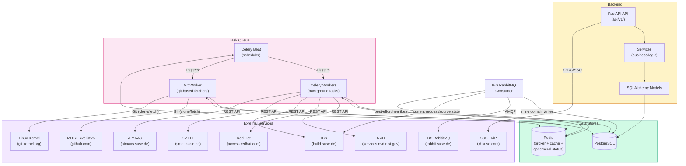
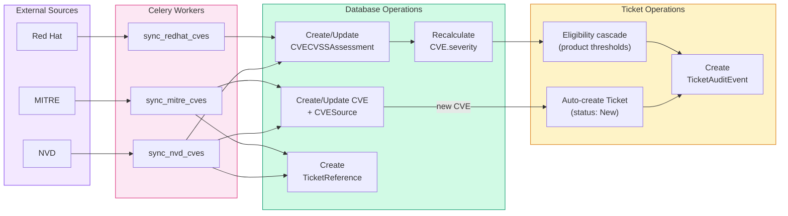
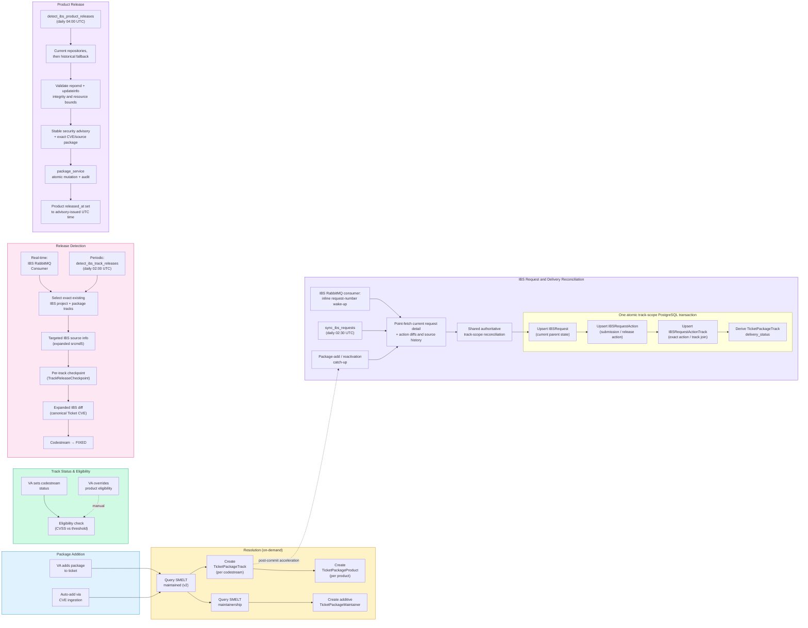
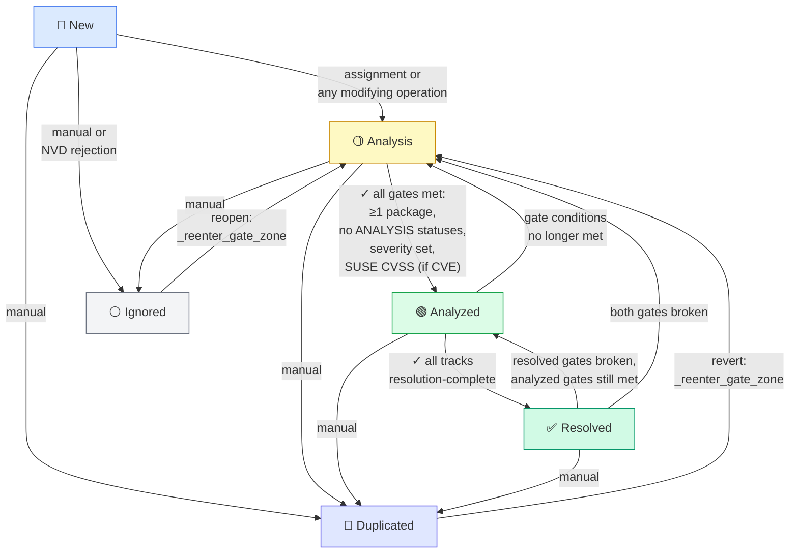
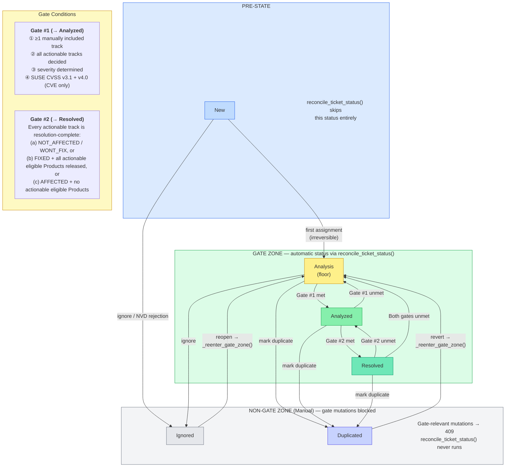
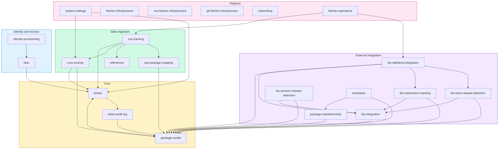

# System Map

Visual overview of the Sentinel platform. This document provides navigational
diagrams to understand how components, data, and features relate to each
other. For full details, follow the links to the relevant specification
documents.

## Table of Contents

- [System Components](#system-components)
- [Data Model](#data-model)
- [Data Flows](#data-flows)
  - [CVE Ingestion](#cve-ingestion)
  - [Package and Release Tracking](#package-and-release-tracking)
  - [Ticket Lifecycle](#ticket-lifecycle)
  - [Ticket Status Zones](#ticket-status-zones)
- [Feature Specification Map](#feature-specification-map)

---

## System Components

How the main components of Sentinel connect to each other and to external
services. See [architecture.md](architecture.md) for architectural
decisions and design constraints.

---

## Data Model

Entity-relationship diagram showing all database tables and their
connections. Only primary keys and foreign keys are shown for readability.
See [data-model.md](data-model.md) for full column details.

The diagram contains 34 physical tables across the groups summarized below.

```mermaid
erDiagram
    CVE {
        UUID id PK
        VARCHAR cve_id UK
        VARCHAR severity
        VARCHAR cve_state
    }

    CVESource {
        UUID id PK
        UUID cve_id FK
        VARCHAR source
        VARCHAR status
    }

    CVECVSSAssessment {
        UUID id PK
        UUID cve_id FK
        VARCHAR provider_name
        VARCHAR cvss_version
        DECIMAL score
    }

    CVEExternalIdentifier {
        UUID id PK
        UUID cve_id FK
        VARCHAR source
        VARCHAR identifier
    }

    CVEAffectedVersion {
        UUID id PK
        UUID cve_id FK
        VARCHAR source_container
        VARCHAR vendor "nullable"
        VARCHAR product "nullable"
    }

    CVECWE {
        UUID id PK
        UUID cve_id FK
        VARCHAR cwe_id
        VARCHAR source
    }

    CVESSVCAssessment {
        UUID id PK
        UUID cve_id FK "unique"
        VARCHAR exploitation
    }

    CVEKEVEntry {
        UUID id PK
        UUID cve_id FK "unique"
        DATE date_added
    }

    CVEEPSSScore {
        UUID id PK
        UUID cve_id FK "unique"
        FLOAT score
        FLOAT percentile
    }

    Ticket {
        UUID id PK
        INTEGER sequence_id UK
        UUID cve_id FK "nullable, unique"
        VARCHAR status
        BOOLEAN is_confidential
        UUID assignee_id FK "nullable"
        UUID duplicate_of_id FK "nullable, self-ref"
    }

    TicketAuditEvent {
        UUID id PK
        UUID ticket_id FK
        UUID user_id FK "nullable"
        VARCHAR event_type
    }

    TicketAccessGrant {
        UUID ticket_id PK_FK
        UUID user_id PK_FK
        UUID granted_by_id FK
    }

    TicketReference {
        UUID id PK
        UUID ticket_id FK
        TEXT url
    }

    TicketPackage {
        UUID id PK
        UUID ticket_id FK
        VARCHAR package_name
    }
    TicketPackageMaintainer {
        UUID id PK
        UUID ticket_package_id FK
        UUID user_id FK
    }

    TicketPackageTrack {
        UUID id PK
        UUID ticket_package_id FK
        VARCHAR workflow_type
        VARCHAR reference
        VARCHAR status
        VARCHAR delivery_status
    }

    TicketPackageProduct {
        UUID id PK
        UUID ticket_package_track_id FK
        UUID product_id FK
        BOOLEAN eligible
        BOOLEAN is_eligible_override
        TIMESTAMPTZ released_at "nullable"
    }

    Product {
        UUID id PK
        VARCHAR cpe UK
        VARCHAR name
        VARCHAR version
        DECIMAL cvss_threshold "nullable"
        DATE first_customer_ship_date "nullable"
        DATE general_support_end_date "nullable"
        DATE extended_support_end_date "nullable"
        DATE reactive_support_end_date "nullable"
        TIMESTAMPTZ catalog_last_seen_at
    }

    ProductRepository {
        UUID id PK
        UUID product_id FK
        VARCHAR repo_name
        TIMESTAMPTZ catalog_last_seen_at
    }

    User {
        UUID id PK
        VARCHAR username UK
        VARCHAR email UK
        UUID external_id "UNIQUE, nullable"
        UUID manager_id FK "nullable"
    }

    UserRole {
        UUID id PK
        UUID user_id FK
        VARCHAR role
        VARCHAR group_name
        UUID assigned_by FK "nullable"
    }

    RoleMapping {
        UUID id PK
        VARCHAR group_name
        VARCHAR role
        UUID created_by FK
    }

    Session {
        UUID id PK
        UUID user_id FK
        TIMESTAMPTZ expires_at
        BOOLEAN is_active
    }

    ApiKey {
        UUID id PK
        UUID user_id FK
        VARCHAR key_hash UK
        VARCHAR prefix
        VARCHAR name
        TIMESTAMPTZ expires_at "nullable"
        TIMESTAMPTZ revoked_at "nullable"
        UUID revoked_by FK "nullable"
    }

    IdentityAuditEvent {
        UUID id PK
        VARCHAR event_type
        UUID user_id FK "nullable"
        UUID target_user_id FK "nullable"
    }

    SystemSetting {
        VARCHAR key PK
        VARCHAR value
    }

    SettingAuditEvent {
        UUID id PK
        VARCHAR event_type
        VARCHAR setting_key
        UUID user_id FK "nullable"
    }

    TrackReleaseCheckpoint {
        UUID id PK
        UUID ticket_package_track_id FK
        VARCHAR srcmd5
        TIMESTAMPTZ last_seen_at
    }

    IBSRequest {
        UUID id PK
        INTEGER request_number UK
        VARCHAR state
        INTEGER superseded_by_request_number "nullable"
        TIMESTAMPTZ upstream_created_at
        TIMESTAMPTZ upstream_updated_at
    }

    IBSRequestAction {
        UUID id PK
        UUID ibs_request_id FK
        VARCHAR action_type
        VARCHAR logical_package
        VARCHAR codestream_name
        INTEGER incident_number "nullable"
    }

    IBSRequestActionTrack {
        UUID id PK
        UUID ibs_request_action_id FK
        UUID ticket_package_track_id FK
    }

    FetcherConfig {
        VARCHAR fetcher_name PK
        BOOLEAN enabled
    }

    FetcherRun {
        UUID id PK
        VARCHAR fetcher_name FK
        VARCHAR status
        UUID triggered_by_user_id FK "nullable"
    }

    FetcherAuditEvent {
        UUID id PK
        VARCHAR fetcher_name FK
        VARCHAR event_type
        UUID user_id FK "nullable"
    }

    CVE ||--o{ CVESource : "has sources"
    CVE ||--o{ CVECVSSAssessment : "has assessments"
    CVE ||--o{ CVEExternalIdentifier : "has external identifiers"
    CVE ||--o{ CVEAffectedVersion : "has affected versions"
    CVE ||--o{ CVECWE : "has weaknesses"
    CVE ||--o| CVESSVCAssessment : "has SSVC assessment"
    CVE ||--o| CVEKEVEntry : "is in KEV catalog"
    CVE ||--o| CVEEPSSScore : "has EPSS score"
    CVE |o--o| Ticket : "tracked by"

    Ticket ||--o{ TicketAuditEvent : "has events"
    Ticket ||--o{ TicketAccessGrant : "has access grants"
    Ticket ||--o{ TicketReference : "has references"
    Ticket ||--o{ TicketPackage : "has packages"
    Ticket }o--o| User : "assigned to"
    Ticket }o--o| Ticket : "duplicate of"

    TicketAccessGrant }o--|| User : "granted to"
    TicketAccessGrant }o--|| User : "granted by"

    TicketPackage ||--o{ TicketPackageTrack : "has tracks"
    TicketPackage ||--o{ TicketPackageMaintainer : "has maintainers"
    TicketPackageMaintainer }o--|| User : "references"
    TicketPackageTrack ||--o{ TicketPackageProduct : "has products"
    TicketPackageTrack ||--o| TrackReleaseCheckpoint : "has release checkpoint"
    TicketPackageProduct }o--|| Product : "targets"

    Product ||--o{ ProductRepository : "has repositories"

    User ||--o{ UserRole : "has roles"
    User ||--o{ Session : "has sessions"
    User ||--o{ ApiKey : "owns keys"
    User ||--o{ TicketAuditEvent : "performed"
    RoleMapping }o--|| User : "created by"
    ApiKey }o--o| User : "revoked by"
    IdentityAuditEvent }o--o| User : "performed by"
    IdentityAuditEvent }o--o| User : "targets"

    IBSRequest ||--o{ IBSRequestAction : "has actions"
    IBSRequestAction ||--o{ IBSRequestActionTrack : "has track links"
    IBSRequestActionTrack }o--|| TicketPackageTrack : "correlates"

    FetcherConfig ||--o{ FetcherRun : "has runs"
    FetcherConfig ||--o{ FetcherAuditEvent : "has audit events"
    SystemSetting ||--o{ SettingAuditEvent : "has audit events"
    FetcherRun }o--o| User : "triggered by"
    FetcherAuditEvent }o--o| User : "performed by"
    SettingAuditEvent }o--o| User : "performed by"
```

### Entity Groups

| Group | Tables | Purpose |
|-------|--------|---------|
| **CVE Core** | CVE, CVESource, CVECVSSAssessment, CVEExternalIdentifier | Vulnerability data from external sources — drives ticket creation and severity |
| **CVE Enrichment** | CVEAffectedVersion, CVECWE, CVESSVCAssessment, CVEKEVEntry, CVEEPSSScore | Supplementary CVE intelligence from secondary sources (CISA, FIRST) |
| **Ticket Domain** | Ticket, TicketAuditEvent, TicketAccessGrant, TicketReference, TicketPackage, TicketPackageMaintainer, TicketPackageTrack, TicketPackageProduct | Security workflow, audit trail, and access control |
| **Product Domain** | Product, ProductRepository | SUSE distribution products and update repositories |
| **Identity Domain** | User, UserRole, RoleMapping, Session, ApiKey, IdentityAuditEvent | Users, roles, sessions, API keys, and identity audit trail |
| **IBS Integration** | IBSRequest, IBSRequestAction, IBSRequestActionTrack | Current IBS request parents, normalized submission/release actions, and exact track correlations |
| **Platform** | FetcherConfig, FetcherRun, FetcherAuditEvent, SystemSetting, SettingAuditEvent | Background task monitoring and system configuration |
| **Operational** | TrackReleaseCheckpoint | Per-track expanded IBS source state last successfully examined |

---

## Data Flows

### CVE Ingestion

How CVEs flow from external sources into Sentinel and trigger ticket creation.
See [features/tickets/cve-tracking.md](features/tickets/cve-tracking.md) and
[features/tickets/cvss-scoring.md](features/tickets/cvss-scoring.md).

### Package and Release Tracking

How packages are resolved, tracked across codestreams and products, and how
releases are detected. See
[features/packages/package-model.md](features/packages/package-model.md),
[features/integrations/ibs-integration.md](features/integrations/ibs-integration.md),
[features/integrations/ibs-rabbitmq-integration.md](features/integrations/ibs-rabbitmq-integration.md),
and [features/packages/ibs-submission-tracking.md](features/packages/ibs-submission-tracking.md).

### Ticket Lifecycle

State machine for ticket status transitions. Gates control automatic
transitions between Analysis, Analyzed, and Resolved. See
[features/tickets/tickets.md](features/tickets/tickets.md).

**Analyzed gate** (all must be true):
- At least one manually included `TicketPackageTrack`
- No actionable `TicketPackageTrack` in `ANALYSIS` status
- Severity is determined (not `NULL`)
- If CVE is associated: SUSE CVSS v3.1 and v4.0 assessments exist

**Resolved gate**: every actionable `TicketPackageTrack` is
resolution-complete: (a) `NOT_AFFECTED`/`WONT_FIX`, or (b) `FIXED` with
all actionable eligible Products having `released_at IS NOT NULL`, or
(c) `AFFECTED` with no actionable eligible Products. Actionability combines
manual hierarchical exclusion with derived Product EOL; it is not persisted.
Delivery status
(`PENDING`/`IN_PROGRESS`/`RELEASED`) is tracked independently for workflow
visibility but is not a gate condition.

### Ticket Status Zones

The ticket state machine is divided into distinct zones that determine how
status transitions are governed. See
[features/tickets/ticket-mutations.md](features/tickets/ticket-mutations.md)
for the authoritative zone definitions and gate evaluation logic.

**Zone summary:**

| Zone | Statuses | Governed by | Gate mutations |
|------|----------|-------------|----------------|
| Pre-state | `New` | Explicit assignment only | Allowed but do not trigger reconciliation |
| Gate zone | `Analysis`, `Analyzed`, `Resolved` | `reconcile_ticket_status()` — sole authority | Allowed; each triggers reconciliation |
| Non-gate zone | `Ignored`, `Duplicated` | Explicit user actions | **Blocked** (`TicketNotMutableError` → 409) |

Re-entry from the non-gate zone always passes through `_reenter_gate_zone()`,
which sets the floor (`Analysis`) and calls `reconcile_ticket_status()` to
promote to the correct status in a single transaction.

---

## Feature Specification Map

How the feature specifications relate to each other. Arrows indicate
dependencies (A → B means A depends on or references B). Specs are
grouped by domain. See individual specs in [features/](features/).

### Hub Specifications

The two most interconnected specifications, referenced by almost every
other feature:

- **[tickets](features/tickets/tickets.md)**: the central workflow entity — ticket
  creation, lifecycle, status gates, severity resolution. The service-layer
  module contract is in
  [ticket-mutations](features/tickets/ticket-mutations.md)
- **[package-model](features/packages/package-model.md)**: codestream/product
  resolution, status propagation, eligibility rules, and release detection

### Specification Index

| Spec | Domain | Summary |
|------|--------|---------|
| [tickets](features/tickets/tickets.md) | Core | Ticket entity, lifecycle, gates, severity resolution |
| [ticket-audit-log](features/tickets/ticket-audit-log.md) | Core | Audit trail via TicketAuditEvent records |
| [package-model](features/packages/package-model.md) | Core | Track affectedness, product eligibility, and release detection |
| [cve-tracking](features/tickets/cve-tracking.md) | Ingestion | CVE sync from NVD, MITRE, and other sources |
| [cvss-scoring](features/tickets/cvss-scoring.md) | Ingestion | Multi-provider CVSS assessment and severity derivation |
| [references](features/tickets/ticket-references.md) | Ingestion | External links on tickets (auto and manual) |
| [cpe-package-mapping](features/packages/cpe-package-mapping.md) | Ingestion | CPE-to-package resolution via static mapping file |
| [ibs-integration](features/integrations/ibs-integration.md) | Integration | IBS API client for source info, diffs, and requests |
| [ibs-rabbitmq-integration](features/integrations/ibs-rabbitmq-integration.md) | Integration | Real-time IBS track-release and request/submission acceleration via RabbitMQ |
| [ibs-submission-tracking](features/packages/ibs-submission-tracking.md) | Integration | Current IBS request actions, exact track correlation, and delivery reconciliation |
| [ibs-track-release-detection](features/packages/ibs-track-release-detection.md) | Integration | Existing-track reconciliation via expanded IBS source state and per-track checkpoints |
| [ibs-product-release-detection](features/packages/ibs-product-release-detection.md) | Integration | Product release reconciliation via validated stable security advisories and exact source-package matches |
| [package-maintainership](features/packages/package-maintainership.md) | Integration | SMELT package maintainer acquisition and durable package associations |
| [identity-provisioning](features/identity/identity-provisioning.md) | Identity | External identity provisioning (not yet active) |
| [rbac](features/identity/rbac.md) | Identity | Role-based access control and permissions |
| [system-settings](features/platform/system-settings.md) | Platform | System settings (default CVSS version) |
| [fetcher-infrastructure](features/platform/fetcher-infrastructure.md) | Platform | BaseFetcher base class, registry, data model |
| [cve-fetcher-infrastructure](features/platform/cve-fetcher-infrastructure.md) | Platform | BaseCVEFetcher base class, CVE fetcher conventions |
| [git-fetcher-infrastructure](features/platform/git-fetcher-infrastructure.md) | Platform | BaseGitFetcher base class, git_operations, delta flow |
| [networking](features/platform/networking.md) | Platform | Shared HTTP client factory, transport retry, TLS trust store |
| [fetcher-operations](features/platform/fetcher-operations.md) | Platform | Background task monitoring, API, and CLI diagnostics |
| [maintainer](features/packages/maintainer.md) | Integration | Maintainer-oriented package/ticket views |
